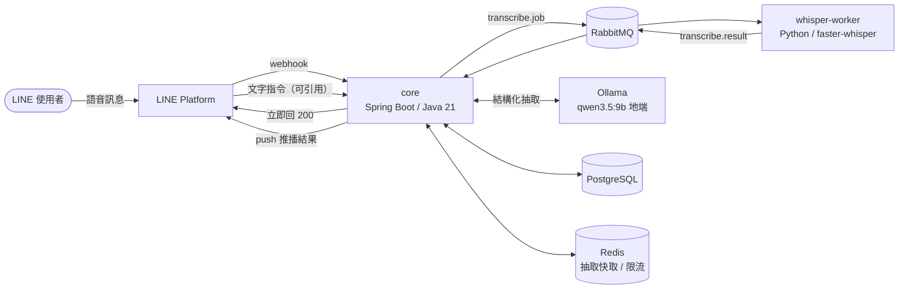

# SVRA — 個人語音知識助理平台

> 對 LINE 說一句話，系統轉錄、理解、歸檔，並能用自然語言問回來。

**專案緣起（2024）**：我一直覺得「有個助理幫你接住生活與工作的大小事」
不該是老闆的特權——每個人都值得有一個。所以在公司內部的 AI 創新應用競賽
做了第一版：LINE 收語音、Whisper 轉文字、同步到備忘錄。
127 行的單檔腳本（見 [legacy/app.py](legacy/app.py)），能動就好。

**為什麼重構成這樣（2026）**：以單人使用的規模，這套架構是**過度設計**的。
一天幾則語音訊息，2024 那版腳本完全夠用。

這是刻意的。我在上一份工作做了半年金流平台維運，看到的是系統的另一面：
**當冪等與失敗補償缺席時，維運端要承擔多少重複的、本來可以被設計掉的工作。**
我能定位問題、能給 workaround，但改不了根因。

「知道這些設計為什麼重要」和「親手把它做對」是兩回事。
這個 repo 是後者——拿一個我熟悉的產品當載體，把那些東西實作一次，
並且把每一步**為什麼這樣選、放棄了什麼、什麼情況會反悔**寫下來。

---

## 目前進度

| 狀態 | 項目 |
|------|------|
| ✅ | LINE webhook 接收：HMAC-SHA256 驗簽、秒回 200 |
| ✅ | `notes` schema（Flyway）＋ JPA entity／repository，含冪等唯一鍵 |
| ✅ | 轉錄 worker：faster-whisper ＋ Breeze-ASR-25（台灣調校） |
| ✅ | docker-compose：PostgreSQL(pgvector) / RabbitMQ / Redis / worker |
| ✅ | Transactional Outbox：音檔下載與 `transcribe.job` 發佈，含指數退避與 DLQ |
| ✅ | 轉錄結果消費、冪等去重 |
| ✅ | LLM 結構化抽取：Spring AI ＋ 地端 Ollama，含領域驗證與帶錯誤重試 |
| ✅ | 結果推播回 LINE |
| ✅ | 文字指令：刪除／改標題／改時間／新增／列出，一句話可含多個動作 |
| ✅ | 指令冪等：執行紀錄擋住 outbox 重投，回覆與變更同交易寫入 |
| ✅ | Spring Modulith 模組邊界驗證（`ApplicationModules.verify()`） |
| ✅ | 抽取層 eval 集（8 題，prompt 迭代到 v6，8/8） |
| ✅ | DLQ 補償：任務與結果兩條死信路徑都有消費者，失敗會通知使用者 |
| ✅ | Redis：抽取結果快取與 per-user 限流，Redis 掛掉時降級不中斷 |
| ✅ | 整合測試：Testcontainers 跑真的 PostgreSQL，守住冪等／`SKIP LOCKED`／交易邊界 |
| ✅ | Spring Security：驗簽進 filter chain、body 緩衝、其餘端點預設拒絕 |
| ✅ | ASR 層 eval 集（6 則真實語音，CER ＋ 專有名詞命中率，含模型與後端比較） |
| 📋 | RAG 與向量檢索（見 [Future Work](#future-work)） |

端到端已用真實 LINE 語音驗證：webhook → 驗簽 → note+outbox 同交易 →
poller 下載音檔 → RabbitMQ → whisper → 結果回寫 → LLM 抽取 → 推播回 LINE。
使用者可以引用推播訊息、用一句話修改或刪除其中的項目，也可以直接問「現在有什麼行程」。

**全程在本機執行**：語音轉錄與語意抽取都是地端模型，不呼叫任何付費 API。

範圍凍結日：2026-08-18。**凍結的是功能範圍，不是缺陷**——feature freeze 不是
bug freeze，已知的正確性問題該修還是修（決策 24 就是凍結之後修的）。
新功能一律進 [Future Work](#future-work)，但**每一項都會寫清楚
「評估過、決定不做、理由是什麼」**——因為說得出取捨，比做完但講不出所以然更有價值。

## 架構



| 組件 | 技術 | 職責 |
|------|------|------|
| core | Java 21 / Spring Boot 4.1 ＋ Security 7 | Webhook 接收與驗簽、Outbox 編排、LLM 抽取 |
| whisper-worker | Python / faster-whisper ＋ Breeze-ASR-25 | 語音轉文字（無狀態，可水平擴展） |
| 佇列 | RabbitMQ | 任務分派、DLQ 補償 |
| 儲存 | PostgreSQL | 筆記本體、outbox 事件、抽取結果（pgvector 已備妥） |
| LLM | Spring AI ＋ Ollama | 結構化抽取，地端執行 |
| 快取/限流 | Redis | 抽取結果快取、per-user 限流（見決策 14） |

---

## Design Decisions & Trade-offs

### 1. Webhook 秒回 200，重活丟佇列

**決策**：webhook 驗完簽章立刻回 200，轉錄工作發到 RabbitMQ 非同步處理。

**為什麼**：LINE webhook 有逾時限制，而語音轉錄要數十秒——同步做**必然超時**。
更關鍵的是逾時後 LINE 會**重送同一則訊息**，所以「慢」不只是慢，是會**製造重複**。

**放棄了什麼**：使用者拿不到即時回覆（要靠後續 push 訊息通知），
系統多了一個需要維運的元件（佇列本身可能掛、可能堆積）。

**什麼情況會反悔**：如果轉錄能壓到 1 秒內（例如換成串流式短語音），
同步處理反而簡單；佇列的價值來自「工作比逾時長」這個前提。

### 2. 冪等：DB 唯一約束，而且不能靠例外

**決策**：`notes.source_message_id` 上建 UNIQUE 約束，寫入用
`INSERT ... ON CONFLICT DO NOTHING`，回傳影響列數為 0 就是「已處理過」。

**為什麼要唯一約束**：上游是 at-least-once，重送是常態不是意外。
而常見的三種做法只有一種可靠：

| 做法 | 問題 |
|------|------|
| 先 `SELECT` 再 `INSERT` | **race condition**——兩個執行緒可能同時查到「不存在」然後都插入 |
| Redis 檢查已處理 id | 一樣有 race（檢查與寫入非原子，除非 `SETNX`）；且快取不是真相來源，掉資料就失效 |
| Java `synchronized` | 只鎖得住單一 JVM，多實例部署（多個 pod）立刻失效 |
| **DB 唯一約束** ✅ | 由資料庫層強制的原子性，跨執行緒、跨實例、跨重啟都成立 |

#### 為什麼不是 `catch (DataIntegrityViolationException)`

這裡原本是 `save()` 加上捕捉例外，看起來完全合理，也通過了六個單元測試。
它是壞的，而且壞在測試看不到的地方。

唯一鍵衝突會讓 Hibernate 把**整個交易標成 rollback-only**。就算把例外接住、
乾乾淨淨地回傳 `false`，交易在 commit 時仍然會拋 `UnexpectedRollbackException`
——它**從 catch 外面穿出去**，傳到 webhook，回 500，LINE 就再送一次。

**冪等機制本身變成了無限重送的來源。**

```
兩個執行緒同時送同一則訊息
  ├─ 執行緒 A：insert 成功 → 回 200
  └─ 執行緒 B：insert 撞唯一鍵 → catch 住 → return false
                                   └─ commit 時 UnexpectedRollbackException → 500 → LINE 重送
```

那為什麼不把 insert 移到 `REQUIRES_NEW` 的內層交易？因為 note 與 outbox 事件
**必須同進同退**——拆成兩個交易就等於放棄 outbox 的全部價值（決策 3）。
這裡有一個真實的張力：**exception-based 冪等與 outbox 模式不相容**，
前者要求失敗被隔離，後者要求寫入不可分割。

`ON CONFLICT DO NOTHING` 同時滿足兩邊：衝突由資料庫原子地吞掉、不拋例外、
不弄髒交易，而判斷依然發生在資料庫層。後來者會阻塞到先來者提交為止，
所以「回傳 1」的執行緒有且只有一個。

> **這件事只有整合測試抓得到。** 用 Mockito 讓 repository 拋
> `DataIntegrityViolationException` 驗證的是「呼叫端會處理這個例外」，
> 而問題發生在**那個例外底下的交易狀態**——mock 沒有交易，所以永遠是綠的。
> 現在由 `IdempotencyIntegrationTest` 跑真的 PostgreSQL 守著（見決策 21）。

**放棄了什麼**：`ON CONFLICT` 是 PostgreSQL 的語法，這段查詢不再可攜。
以這個專案的規模，換資料庫比改這行難得多，所以接受。

**什麼情況會反悔**：如果冪等鍵不是單一欄位、或需要在寫 DB 前就擋掉
（例如避免昂貴的前置運算），會改用 Redis `SETNX` 當前置閘門，**但 DB 約束仍然保留當最後防線**。

#### 文字指令一度完全沒有這道防線

語音有 `notes.source_message_id` 擋著，但**文字指令不建 note**，只寫一筆 outbox
——而 `outbox_events` 上當時沒有任何唯一約束。指令那段的
`catch (DataIntegrityViolationException)` 是一段**永遠不會執行的死碼**：
表上根本沒有約束可以違反。LINE 逾時重送一次，「刪掉第一筆」就執行兩次。

修法是給 outbox 加一個**可為 NULL 的 `dedupe_key`** 加部分唯一索引，
而不是對 `(aggregate_id, event_type)` 整張表設唯一——因為不是每種事件都只該
發生一次，決策 9 明講了「換模型重跑抽取、兩版並存」是預期用法，
整張表的約束會把那條路永久堵死。**由產生事件的一方決定「這件事只該做一次」。**

> **這一層擋的是「重複記錄」，不是「重複執行」。** 同一則指令只會寫下一筆 outbox 事件，
> 但那筆事件本身仍可能被處理第二次——而指令是位置性的，重跑會作用到別的項目上。
> 那是另一種冪等，唯一鍵擋不住，見決策 24。

### 3. Transactional Outbox：先寫意圖，再送訊息

**決策**：`recordIncoming()` 在**同一個交易**裡寫 `notes` 與 `outbox_events`
兩張表，訊息由背景 poller 讀 outbox 後才真的發到 RabbitMQ。

**為什麼**：「寫資料庫」和「發訊息」是兩個系統，沒有共同的交易。
先發訊息再寫 DB，DB 失敗就發出了不存在的任務；先寫 DB 再發訊息，
發送失敗任務就永遠不會執行——而 note 停在 PENDING，**沒有人知道它被放棄了**。

Outbox 把「要發訊息」變成一筆資料，跟業務資料同進同退。
交易提交就代表意圖已持久化，RabbitMQ 掛掉只會延遲，不會遺失。

**放棄了什麼**：**Outbox 不消除兩系統提交問題，它把「可能遺失」換成「可能重複」**——
poller 送出訊息後、標記 SENT 前掛掉，重啟會再送一次。
代價是下游必須冪等（at-least-once），這也是為什麼 `applyTranscription()` 要擋重複結果。

還有輪詢延遲（本專案 2 秒）與一張要維運的表。

**多實例怎麼辦**：`SELECT ... FOR UPDATE SKIP LOCKED`——
多個 poller 各自鎖住不同批次，不會重複處理同一筆。

**踩過的坑：重試上限一度是假的。** poller 把事件處理器（`OutboxEventHandler` 的實作）的例外接住、呼叫 `markFailed()`
累加次數，看起來很正常——但處理器的 `@Transactional` 在例外往外傳時已經把交易標成
rollback-only，外層 commit 時拋 `UnexpectedRollbackException`，**連 `markFailed()`
一起被回滾**。症狀是 `attempts` 永遠停在 0、事件無限重試、同一批的其他事件也陪葬。

**寫得出重試邏輯，不代表重試會發生**——交易邊界錯了，錯誤處理本身也會被回滾。

當時的修法是讓處理器跑在 `REQUIRES_NEW` 的獨立交易裡。隔離的效果是對的，
但那個選擇有個副作用，見決策 18。

**什麼情況會反悔**：如果訊息遺失可以接受（例如可重算的衍生資料），
直接發訊息簡單得多。Outbox 的成本只有在「這筆任務不能掉」時才值得。

### 4. RabbitMQ 而非 Kafka

**決策**：用 RabbitMQ。

**為什麼**：這是**任務佇列**（逐訊息 ack、失敗進 DLQ、公平分派給重活 worker），
不是事件流。Kafka 的 partition／offset／consumer group 模型在這裡沒有回報，只有運維成本。

**放棄了什麼**：訊息重播能力、超高吞吐、多消費者各自獨立進度。

**什麼情況會反悔**：當「同一份轉錄結果需要被多個下游各自消費」
（例如同時要進搜尋索引、進資料倉儲、觸發通知），或需要回溯重放歷史事件時，Kafka 才划算。

### 5. Java 編排 ＋ Python ML worker

**決策**：核心編排用 Java/Spring Boot，語音轉錄留在 Python。

**為什麼**：**語言邊界就是服務邊界**。ML 生態在 Python，企業級後端生態在 Java——
與其勉強在單一語言裡湊合，不如讓各自做最擅長的事，用佇列的 JSON 契約解耦。

**放棄了什麼**：多一套部署與監控、跨語言契約要自己維護版本、
本機開發要同時起兩個 runtime。

**什麼情況會反悔**：如果轉錄改成呼叫外部 API（不自己跑模型），
Python worker 就沒有存在必要，整併回 Java 更簡單。

### 6. 簽章驗證放在 Controller，不放 Filter

> ⚠️ **這則決策已被決策 22 推翻。** 保留原文是因為它的推理有一半是錯的，
> 而錯的那一半正是後來動手時才看清楚的——見下方「後來怎麼了」。

**決策**：HMAC 驗簽寫在 `LineWebhookController`，沒有抽到 Filter／Interceptor。

**為什麼**：橫切關注點原則上該進 Filter，但**簽章需要 raw body**，
而 request body 是 `InputStream`——**讀完就沒了**。在 Filter 讀了，
Controller 的 `@RequestBody` 就拿到空的，得用 `ContentCachingRequestWrapper`
包一層才能讀第二次。目前只有一個 webhook 端點，多包一層不划算。

**什麼情況會反悔**：接第二個 webhook 來源時（Slack／Stripe 各自的簽章格式），
就抽到 Filter 統一處理，那時 wrapper 的成本才有意義。

> 兩個實作細節：驗簽用 `@RequestBody String` 取**原始字串**
> （先反序列化再序列化回來會因空白／欄位順序差異導致簽章對不上）；
> 比對用 `MessageDigest.isEqual()` 而非 `equals()`——固定時間比較，避免 timing attack。

#### 後來怎麼了

結論（成本不划算）在當時站得住腳，但**理由裡有一個具體的技術錯誤**：
`ContentCachingRequestWrapper` **做不到**這件事。它的 `getInputStream()` 回傳的是
包住底層 stream 的 `ContentCachingInputStream`，邊讀邊記——filter 讀完之後底層已經
耗盡，Controller 拿到的還是空的。它的設計目的是**事後**記 log
（`AbstractRequestLoggingFilter`），不是 replay，這是 [spring-boot#10452] 記錄的
已知限制。要 replay 只能自己寫在建構子就把 body 收完的 wrapper。

也就是說：當時「不划算」的估價，是照一個**根本不存在的便宜選項**算的。
真正的成本比想像高（要自己寫 wrapper），但真正的收益也比想像高（Controller
可以完全不碰 raw body）。見決策 22。

[spring-boot#10452]: https://github.com/spring-projects/spring-boot/issues/10452

### 7. Package by feature，並讓邊界成為會失敗的測試

**決策**：`io.svra.{webhook, security, line, note, outbox, mq, extract, notify, command}`，
而不是 `{controller, service, repository, entity}`。加上 Spring Modulith 的
`ApplicationModules.verify()`。

**為什麼**：這是事件驅動系統，邊界天生清楚。按功能切的話，
**一個變更只動一個資料夾**，而且可以用 package-private 真正擋住跨模組呼叫。

分成三層責任：

| | package | 責任 |
|---|---|---|
| 入站 | `webhook/` | LINE 對我們說話：解析、分派 |
| 門口 | `security/` | 誰進得來：body 緩衝、HMAC 驗簽、filter chain（決策 22） |
| 出站 | `line/` | 我們對 LINE 說話：下載音檔、推播 |
| 領域 | `note/` | `Note`、`NoteExtraction`、`NoteItem` 與其 repository |
| 基礎設施 | `outbox/`、`mq/` | 事件轉送、佇列 topology |
| 功能 | `extract/`、`notify/`、`command/` | 各自消費領域模型 |

每個功能 package 對外只露出一個入口，其餘收成 package-private：

| package | 對外可見 | 收在裡面 |
|---|---|---|
| `extract/` | `NoteExtractionService` | `NoteExtractor`、`ExtractedNote` |
| `notify/` | `NoteNotifier` | — |
| `command/` | `NoteCommandService` | `NoteCommandParser`、`NoteCommand` |

**放棄了什麼**：不如分層直覺（多數教學文都是分層），新人上手需要適應。

#### 這則決策踩過兩次，第二次是工具抓到的

**第一次**：加推播與指令功能時，我把它們放進了 `extract/`——因為實體已經在那裡。
那是 by-layer 的慣性：按「技術上相依什麼」放，而不是按「這是什麼功能」放。

**第二次**：搬完之後看起來很整齊，`ApplicationModules.verify()` 一跑就爆出環狀依賴。
**檔案位置對了，相依方向還是纏的：**

```
outbox  ↔ 每一個功能   poller 用 switch 認識全部四種事件，功能又回頭寫 outbox
line    ↔ command      控制器呼叫指令服務，指令服務又用 LinePushClient
note    ↔ mq           NoteService 的參數型別是 RabbitMQ 的訊息格式
```

三個都是真的設計問題，不是工具太嚴格：

- **基礎設施不該認識業務**。poller 改成只認識 `OutboxEventHandler` 介面，
  各功能自己實作並註冊——加新事件型別不用改 poller。
- **入站與出站是相反方向**，放同一個 package 必然成環。`webhook/` 與 `line/` 拆開後，
  `line/` 對其他模組零依賴。
- **領域不該認識傳輸格式**。`applyTranscription` 原本收 `TranscribeResult`
  （帶著 `@JsonProperty` 與 status／elapsedSec），改成收四個值，翻譯由 listener 做。

> **package-private 擋得住細節外流，擋不住 public 型別之間的相依。**
> 前者靠切法，後者只有工具擋得住——所以 `ApplicationModules.verify()` 不是加分項，
> 是讓這則決策從慣例變成約束的那一步。`Documenter` 會一併產出模組關係圖，
> 結構的變化在 review 時看得見。

### 8. Schema 由 Flyway 單一管理，JPA 只驗證

**決策**：`spring.jpa.hibernate.ddl-auto=validate`，所有 schema 變更走 Flyway migration。

**為什麼**：**單一真相來源**。讓 Hibernate 也能改 schema，就會有兩個東西在管同一件事。
`validate` 讓「entity 與資料庫不一致」在**啟動時就失敗**，而不是執行到那段才炸。

**放棄了什麼**：開發初期改欄位要多寫一個 migration 檔，沒有 `update` 方便。

> 正式環境絕不用 `ddl-auto=update`：它會加欄位但不會刪、順序不可預測、無法 code review、無法回滾。

### 9. LLM 層用 Spring AI，模型跑在地端

**決策**：用 Spring AI 當抽象層，模型是本機 Ollama 上的 qwen3.5:9b。

**為什麼**：抽象層的價值不在「看起來比較乾淨」，在於**換供應商的成本**。
實際換過一次（Anthropic API → 地端 Ollama）動到的東西：

```
core/pom.xml                 starter 一行
application.yml              一段設定
NoteExtractor.java           0 行   ← 呼叫端沒動
測試                          0 行
```

跑地端還有兩個附帶好處：**成本歸零**，以及**語音筆記不離開自己的機器**。

**放棄了什麼**：地端 9B 模型的推理不如雲端旗艦。實測同一段逐字稿，
曾經有個案例：Whisper 把「奮起湖」轉成「正啟湖」，抽取層照原樣保留——
符合 prompt 裡「判斷不出來就照原樣」的規則。**後來才發現那不是抽取層的問題**，
換掉 ASR 模型之後就沒了（見決策 14）。

**什麼情況會反悔**：抽取準確率成為瓶頸時就換模型。`note_extractions`
表的存在就是為了這個——換模型不覆蓋舊結果，兩版並存後再決定用哪個。

> 踩到的坑：qwen3.5 是**思考模型**，預設會思考，一次抽取從 12 秒變成 200 秒以上，
> 而且回應的 `content` 有時是空的。關閉思考需要 `spring.ai.ollama.chat.think`，
> 這個設定鍵到 Spring AI 2.0 才綁得上（1.1.8 雖有 `think-option`，
> 但缺 Boolean → ThinkOption 的轉換器），而 Spring AI 2.0 需要 Spring Boot 4。

### 10. 結構化輸出之外，還要領域驗證

**決策**：LLM 回傳的結果先過 `validate()`，不通過就把**錯誤訊息帶回去**重試一次。

**為什麼**：**結構化輸出解決格式，不解決正確性。**
模型可以回傳完全合法的 JSON，卻把 2026 年的行程推斷成 2019 年。
所以除了 schema，還要檢查內容合不合理：日期在合理範圍、
分類為 SCHEDULE 就必須有時間、title 不可空白。

重試時把驗證錯誤塞回 prompt，而不是單純重送——**模型不知道自己錯了**，
同樣的輸入只會得到同樣的機率分佈。把「你上次 occursAt 給了 8月16號，
那不是 ISO-8601」放進去，它才知道要修哪裡。

**放棄了什麼**：多一次 LLM 呼叫的延遲與成本（地端的話只有延遲）。

**這一層擋不住什麼**：內容錯但格式與範圍都合法的情況。
實測就遇到一次——`detail` 寫「8月16日」但 `occursAt` 填成 08-15，
兩者不一致而驗證抓不到。要抓需要跨欄位的一致性檢查，那是下一層的事。

> **schema 本身也會出錯，而且是往反方向。** 上面說的是「格式對了內容不一定對」；
> 反過來，schema 把一個本來可以沒有的欄位標成必填時，模型就只能編一個值——
> 而編出來的值格式正確，這一層的驗證抓不到。見決策 25。

### 11. 指代解析靠 LINE 的引用，不靠對話狀態

**決策**：使用者引用某則推播訊息下指令時，用 webhook 帶的 `quotedMessageId`
反查是哪一批項目；沒引用時查「這位使用者目前還有效的全部項目」（跨所有語音）。

**為什麼**：「把第二筆改成 8/16」的「第二筆」是相對於某則訊息的。
常見做法是在伺服器記住「這個使用者上次看到什麼」，但那是**對話狀態**——
多裝置、訊息亂序、使用者隔天才回覆，全都會讓它失準。

LINE 的引用功能把這個狀態**放在訊息本身**：使用者指哪則，webhook 就告訴你哪則。
伺服器不需要記憶，也不會過期。

**放棄了什麼**：要多存一欄（`note_extractions.notify_message_id`）。
沒引用時的退路一開始是「最近一次的抽取」，後來改成跨語音查詢——因為使用者問
「現在有什麼行程」時，要的是目前全部，不是最後那則語音的內容。

**編號必須三邊一致**：推播、指令解析、依編號取值都走
`NoteCategory.DISPLAY_ORDER`。這件事一度是壞的——推播依分類重排後編號，
指令那邊用 JPA 給的原始順序，只要抽取結果不是剛好那個順序，「刪掉第一筆」
就會**刪錯而且不報錯**。`ItemNumberingConsistencyTest` 現在守著它。

**什麼情況會反悔**：真正的跨筆記批次操作（「把這週的行程都刪掉」）還是不夠——
目前只做到「跨筆記查詢」，批次條件式刪除得引入工作階段或查詢語言。
引用舊推播時也還有編號漂移的問題（那批被刪過就會重新編號），要解得存編號快照。

### 12. 只做一半要說出來

**決策**：`NoteCommand` 有一個 `unhandled` 欄位，讓 LLM 回報「這次沒能處理的部分」，
回覆時附在後面。

**為什麼**：實測時使用者一句話講了兩件事——「時間應該放在最前面，然後第二筆是 8/16」。
系統只做得到改時間，於是**默默做了一半，回覆也只提改時間**。

這比「看不懂」更糟：看不懂使用者知道要換句話說，做一半使用者以為都交代了。

**放棄了什麼**：多信任 LLM 一個欄位——它可能漏報，或把做到的事誤報成沒做到。

### 13. ASR 用台灣調校的 Breeze-ASR-25，不是更大的 Whisper

**決策**：轉錄模型從 `whisper small` 換成聯發科的 `Breeze-ASR-25`（Whisper large-v2 為底，
已轉成 CTranslate2，可直接餵給 faster-whisper）。

**為什麼**：抽取層的 eval 是 8/8，但實際用起來還是有錯——**錯在上游**。
拿同一段（有背景音的）錄音跑三方比較：

| | 奮起湖 | KKday | 轉錄耗時 |
|---|---|---|---|
| `small`（原本） | ✖ 正啟湖 | ✖ KKM | 6s |
| `large-v3`（單純變大） | ✔ | ✖ 認不出 | 31s |
| `Breeze-ASR-25`（台灣調校） | ✔ | ✔ | 33s |

**第二欄是關鍵**：`KKday` 是中英夾雜，`large-v3` 也修不好，只有台灣調校版能處理——
證明差別來自訓練資料而不是參數量。順帶修好「重新被組成」→「從新北土城」、
「QQ客戶」→「QR code」。

**放棄了什麼**：轉錄從 6 秒變 33 秒，模型從 244MB 變 1.5GB。
這個代價架構已經吸收了——轉錄本來就是非同步的，使用者等 30 秒或 40 秒沒有差別。
**這是「重活丟佇列」那個決策的回報**：它讓後來的品質升級不需要動架構。

#### 後來補了 eval，發現這個決策只對了一半

上面那張表是**一段錄音、兩個詞、肉眼比對**得出來的。結論是對的，
但那個方法不能重跑，也答不出「換 Breeze-ASR-26 會不會更好」。
後來補了 [ASR eval 集](eval/README.md)（6 則真實語音、CER ＋ 專有名詞命中率），
第一次跑就修正了這則決策的理解：

| | 數字 |
|---|---|
| 整體 CER（依字數加權） | 4.43% |
| 平均 CER（每則等重） | **13.73%** |
| 專有名詞命中 | **12/21（57%）** |

**兩個 CER 差三倍，而那個落差本身就是結論**：46 秒的日常獨白拿了 0%——
贅字、自我修正、跳題全部轉對——把加權平均拉漂亮了。而這個服務的輸入
大多是短句，所以等重那個數字才貼近體感。

更關鍵的是第二列。最誇張的案例 CER 只有 **2.1%**，但**飯店名、住宿名、
林鐵三個都錯了**——那是一則旅遊行程筆記，錯的正好是它唯一有用的資訊。
**只看 CER 會把它判定成「幾乎完美」。**

所以決策 13 的修正版是：換 Breeze 是對的，日常華語幾乎無懈可擊；
但**剩下的問題正好就是 Breeze 本來該解決的那一類詞**——台灣專有名詞與短句。

有了尺之後，「該不該換模型」也第一次有了答案（同一批音檔、同一組正規化）：

| 模型 | CER（加權） | 專有名詞 | RTF |
|---|---:|---:|---:|
| **Breeze-ASR-25**（維持） | **4.43%** | 12/21 | 0.47 |
| Breeze-ASR-26 | 11.62% | **13/21** | 0.45 |
| whisper large-v3-turbo | 12.36% | 9/21 | **0.27** |

**維持 25**：CER 幾乎是另外兩個的三分之一，而代價只是比 turbo 慢 1.7 倍
——以「轉錄本來就是非同步」的前提，那個速度差沒有價值。

但 **26 不是「比較差」，是換了一組錯誤**：同一則行程，25 轉對 KKday／QR code
而漏掉蘭桂坊、神木賓館；26 剛好相反。它多吃了一萬小時台語語料，
方向就往中文那側偏，代價是中英夾雜退步。這句話只有把 CER 與專有名詞
分開看才講得出來——**只看總分會直接得出錯誤的結論**。

最有價值的發現反而是：`密室逃脫`、`裕隆城`、`大遠百` **三個模型全錯**。
換模型解決不了它們，那需要 `initial_prompt` 的詞彙提示或轉錄後的對照表修正。
**eval 的價值不只是選模型，更是指出「這個問題不在模型選擇這一層」。**

**試過但撤回的**：VAD（先切掉非語音段落）。直覺上對有背景音的錄音應該有幫助，
實測反而丟字——「奮起湖」在 VAD 開的時候消失。這段是連續獨白、幾乎沒有靜默，
VAD 沒東西可切，只在語音邊界削掉內容。**理由留在程式碼旁邊**，之後遇到大量靜默
或幻覺迴圈的錄音再回頭量一次。

### 14. Redis 只做快取與限流，而換成地端之後理由變了

**決策**：Redis 用於抽取結果快取與 per-user rate limit，**不作為資料真相來源**。

**原本的理由**：LLM 是這個專案裡唯一按次計費的資源，快取與限流直接對應成本。

**換成地端 Ollama 之後那句話就不成立了**——模型跑在自己機器上，呼叫幾次都不用錢。
但這兩個元件沒有因此失去意義，**是理由換了**：

| | 雲端 API 時期 | 地端 Ollama 之後 |
|---|---|---|
| 快取 | 省錢 | **省時間**——一次抽取 12 秒起跳，而 eval 每次跑同一批案例、重跑舊資料、prompt 沒改只是重啟，輸入都一樣 |
| 限流 | 控制帳單 | **保護唯一那個推論資源**——地端只有一份，同時湧進來的請求互相搶 CPU，結果是每一個都變慢 |

**同一個元件，理由跟著部署方式換**。留著它而不重新想一次為什麼，
才是真正該被質疑的地方。

**兩個實作上的取捨**：

- **Redis 掛掉不可以讓抽取跟著掛。** Spring Cache 預設把例外往外拋，那等於讓快取
  變成正確性的相依。改用一個記 warn 就放行的 `CacheErrorHandler`——
  **快取就是快取，掉了要能重算**。限流同理：Redis 連不上時放行，
  為了一個保護措施讓整個功能停擺是本末倒置。
- **超過額度時拋例外，不在原地等。** 呼叫端都跑在 outbox 處理器裡，
  拋出去就會走既有的指數退避——**已經有一套退避了，不要再自己寫一套**，
  而且在那裡阻塞會把 poller 的執行緒佔住。

> **踩到的坑：一個永遠 0% 命中率的快取。** `GenericJacksonJsonRedisSerializer`
> 預設不把型別資訊寫進 JSON，讀回來是 `LinkedHashMap`——轉型時
> `ClassCastException`，被上面那個「失敗就放行」的錯誤處理接住，
> 於是**應用完全正常運作、只是每次都在重打模型**，log 裡只有幾行 warn。
> **刻意設計成安靜降級的東西，就需要有人在別的地方大聲檢查**——
> 現在有一個序列化往返測試守著。快取這個名字只裝一種型別，
> 所以改用具型別的序列化器，順便讓存進 Redis 的內容還看得懂。

---

### 15. 全部服務進 compose，但 Ollama 留在宿主機

**決策**：core 也容器化，`restart: unless-stopped`；**唯獨 Ollama 不進容器**。

**為什麼要容器化 core**：原本 core 靠 `./run-core.sh` 在終端機裡跑，
關掉視窗或重開機它就沒了——而**其他四個服務都還活著**，
看起來一切正常，實際上 webhook 沒有人接。LINE 不會把那段時間的訊息補送，
**那些語音就是永久遺失**。這不是重試機制救得回來的，
因為 outbox 要能重試的前提是「事件已經寫進資料庫」。

**為什麼 Ollama 不進容器**：模型權重 6.6 GB，而且容器裡吃不到 macOS 的
Metal GPU 加速，純 CPU 推論會慢好幾倍。所以它留在宿主機，
容器用 `host.docker.internal` 連回去。

**代價**：多了一個「要記得啟動」的東西，只是從 core 換成了 Ollama。
真正的解法是把 Ollama 也交給行程管理（`brew services`），而不是手動開。

**什麼情況我會反悔**：部署到 Linux 主機且有 NVIDIA GPU 時，
Ollama 容器可以直接吃 `--gpus all`，那時就沒有留在宿主機的理由了。

### 16. DLQ 裡有訊息，不等於有補償

**決策**：`transcribe.jobs.dlq` 與 `transcribe.results.dlq` 各有一個消費者，
收到就讓 note 有終局並通知使用者。

**為什麼**：死信佇列一度是**死路**——宣告了、綁定了、worker 也確實把失敗的任務
reject 進去了，然後**沒有任何人去看**。而此時 outbox 事件早已標成 SENT
（訊息確實送出去了），重試機制完全碰不到它。結果是 note 永遠停在 PENDING，
使用者傳了語音等不到任何東西。

補償原本只覆蓋一半的失敗路徑：

| 失敗在哪 | 誰負責收尾 |
|---|---|
| 任務**根本沒送出去**（音檔下載不到、RabbitMQ 連不上） | outbox 重試耗盡 → `onGiveUp()` ✅ 本來就有 |
| 任務**送出去了但做不完**（音檔解不開、模型爆了） | DLQ → **一度沒有人** |
| 結果**回來了但寫不進去**（資料庫短暫不可用） | 結果佇列 → **一度連 DLQ 都沒有** |

第三列還多一個問題：結果佇列沒掛死信，而 Spring AMQP 預設
`default-requeue-rejected: true`——listener 一拋例外，訊息回到佇列頭被立刻再收一次，
**沒有退避的忙迴圈**，一則壞訊息可以卡住整條線。

**「有 DLQ」和「有補償」是兩件事**：死信佇列只保證訊息不被丟掉，
不保證有人會去看。

**放棄了什麼**：兩個額外的 listener 要維運。而且 AMQP 的佇列參數建立後不能改，
替既有的 `transcribe.results` 加死信設定需要先刪掉那個佇列（見快速開始的升級說明）。

**什麼情況會反悔**：如果失敗只需要「有人被通知」而不需要程式化收尾，
接一個 DLQ 的告警比寫消費者便宜。這裡需要的是改 note 狀態，所以得寫。

---

### 17. 只做一半的失敗處理，比不做更難察覺

**決策**：抽取抽不出東西、逐字稿是空的——這兩條路都要推一則訊息給使用者。

**為什麼**：這兩處原本都是 `log.warn` 之後靜靜 `return`。使用者傳了語音，
等到的是沉默；而 note 停在 COMPLETED，**沒有任何欄位顯示這件事失敗過**。
跟決策 15 講的「note 永遠停在 PENDING、沒有人知道它被放棄了」是同一類問題，
只是躲在成功狀態底下。

同一個判斷的另一個版本在指令層：`occursAt` 的格式驗證原本不在 `validate()` 裡，
真正的 `Instant.parse()` 到套用指令的迴圈中途才跑。模型只要少給時區
（`2026-08-16T09:00`）就會拋例外——而那時前面幾個動作已經改過資料，
整個交易回滾、outbox 重試五次後放棄，**使用者一則回覆都收不到**。
明明有「看不懂就回一句話」的完整路徑，卻走不到。

**驗證的意義是在動手之前就知道做不做得到**，不是在動手途中發現做不到。

---

### 18. 交易邊界第二課：基礎設施該讓開，不是替業務開

**決策**：poller 跑處理器時，把自己的交易**暫時讓開**（`NOT_SUPPORTED`），
而不是**另外開一個**（`REQUIRES_NEW`）。

**為什麼**：決策 3 那個坑的修法是 `REQUIRES_NEW`，隔離效果完全正確。
但它順手做了一件沒被注意到的事——**替所有處理器決定了交易語意**。

而處理器在做的是：下載音檔（HTTP）、發訊息到 RabbitMQ、呼叫 LLM。
其中抽取一次 12 秒起跳，驗證失敗重試就是兩倍。**那 24 秒全程佔著一條資料庫連線，
什麼事也沒做**，同時把交易的存活時間撐到分鐘級（長交易會擋住 vacuum，
也讓連線池在尖峰時見底）。

沒有一個處理器需要 poller 幫它開交易——需要交易的自己標了 `@Transactional`。
換成 `NOT_SUPPORTED` 之後：

- 外層交易被暫停，處理器炸掉也弄髒不了它（隔離效果不變，測試證明了）
- 需要交易的處理器，`REQUIRED` 在沒有外層交易時就是開一個新的（行為不變）
- 不需要的——下載、發訊息、呼叫模型——**就真的不在交易裡跑**

抽取那一層再往下分成三段：**短交易讀取 → 交易外呼叫模型 → 短交易寫入**。
中間那段沒有交易，正是因為它做的不是資料庫的事。

指令那一層後來也走了同一條路（決策 24）。它原本整段標著 `@Transactional`，
而中間呼叫的正是 LLM——**同一個 repo 裡兩條路的交易原則相反**，
而且相反的那一條，正是這一則決策大寫特寫的那條原則。

**基礎設施不該替業務決定要不要交易**——跟決策 7 把 poller 的 `switch`
換成介面是同一件事，只是這次管的是交易而不是型別。

**放棄了什麼**：第三段寫入前要再查一次冪等（中間隔了十幾秒，別的實例可能已經寫了），
而且交易邊界要用 `TransactionTemplate` 明寫，不能只靠一個 `@Transactional` 註解。
後者其實是好事：這個類別**刻意有一段不在交易裡**，而註解只能標在整個方法上。

**什麼情況會反悔**：如果哪天有處理器需要「整段包含外部呼叫都在同一個交易裡」，
那它應該自己標註解，而不是讓 poller 幫全部人決定。

---

### 19. 兩個時鐘不能拿來比大小

**決策**：outbox 的到期判斷用**應用程式傳進去的時刻**，不用資料庫的 `now()`。

**為什麼**：`next_attempt_at` 是應用程式的時鐘寫進去的，而查詢原本寫的是
`WHERE next_attempt_at <= now()`——那個 `now()` 是 **PostgreSQL 的時鐘**。
兩個不同的時鐘在比大小。

整合測試抓到了：剛寫入的事件因為 JVM 比容器快幾毫秒，被自己的查詢判定成
「還沒到期」而整批漏撈。

```
next_attempt_at = 02:43:48.127061   ← JVM 寫的
pg_now          = 02:43:48.123534   ← PostgreSQL 讀的
                                       差 3.5 毫秒，事件就撈不到
```

本機上這個 bug 是隱形的：poller 每 2 秒跑一次，漏掉的下一輪就撈到了。
但 **app 與資料庫分開部署時（K8s，見 Future Work）偏移會是秒級**，
「退避 2 秒」就完全不是設定的那個值。

同一個原則往回推，`markFailed()` 也不再自己讀時鐘——退避時間是要拿去跟
poller 查詢時的「現在」比大小的，**兩邊必須是同一個時鐘**，
而讓實體自己去讀，就沒有任何地方保證得了這件事。

**放棄了什麼**：查詢多一個參數，而且「現在」變成呼叫端的責任。

**什麼情況會反悔**：如果哪天需要純 SQL 的排程（例如用 `pg_cron` 直接處理 outbox），
那時整條路徑都在資料庫裡，用 `now()` 才是對的——**重點從來不是用哪個時鐘，
是比較的兩邊要是同一個**。

---

### 20. 對外只留一個入口

**決策**：actuator 移到 8444，不對外發布；8443 只留 webhook。

**為什麼**：ngrok 綁的是 8443，而 actuator 原本也在那個埠上，
`health` / `info` / `prometheus` 全開、沒有任何驗證。`/actuator/prometheus`
會吐出 JVM、連線池、HTTP 路由等內部細節，**知道網域就打得到**。

對外唯一該存在的入口就是 `/webhook`，而它有 HMAC 驗簽。
保護 actuator 靠的是**網路邊界**，不是密碼。

**放棄了什麼**：要看指標得 `docker compose exec` 進去，或另外接監控網路。
真的要接 Prometheus 時，那條路本來也不該走公網。

**這則決策後來差點被決策 22 弄壞。** 分埠給人一種「那個埠不歸 web 安全管」的直覺，
而那是錯的：Spring Security 一上 classpath，Boot 的
`ServletManagementChildContextConfiguration` 就會把**父 context 的**
`springSecurityFilterChain` 註冊進 management 子 context
（條件是 `@ConditionalOnBean(name = "springSecurityFilterChain", search = ANCESTORS)`）。
8444 照樣走同一份 chain，只是沒有任何設定提到它——`/actuator/prometheus` 會直接變 403，
而且**啟動時毫無徵兆**。`SecurityConfig` 因此顯式給 actuator 一條 `permitAll` 的 chain：
決策 20 的結論沒變，變的是它現在需要被寫出來才成立。

**什麼情況會反悔**：如果 actuator 真的需要跨網路存取，就該給它認證
（Basic 或 mTLS），而不是把 permitAll 那條 chain 開到公網上。

---

### 21. 招牌故事要有測試守著

**決策**：用 Testcontainers 跑真的 PostgreSQL，守住三件事：唯一約束擋得住並行、
`SKIP LOCKED` 讓多實例不重疊、處理器的交易被正確隔離。

**為什麼**：這三件事**沒有一個是 mock 驗得了的**。而在寫這些測試之前：

- 把 `runIsolated()` 整個刪掉，`mvn test` 依然全綠——決策 3 那個坑可以原封不動地回來
- 決策 2 描述的 `catch (DataIntegrityViolationException)` 作法**其實是壞的**，
  而六個單元測試全都是綠的

第二點是這件事的重點。那些測試不是寫得不好，是**它們驗的東西本來就在別的層**：
mock 出來的例外證明「呼叫端會 catch」，而問題發生在那個例外底下的交易狀態，
mock 裡沒有交易。

寫完之後，兩個測試分別在第一次執行就抓到一個真的缺陷。

**放棄了什麼**：`mvn test` 從此需要 Docker，CI 多跑約 4 秒。

**什麼情況會反悔**：如果測試變慢到影響開發節奏，會把整合測試拆成
`-Pintegration` 的獨立 profile（像 eval 那樣），但**預設仍然要跑**——
預設不跑的守門員，跟沒有是一樣的。

---

### 22. 驗簽進 Spring Security，而 body 得自己包一層

**決策**：HMAC 驗簽從 `LineWebhookController` 移到 Spring Security 的 filter chain。
`CachedBodyFilter` 先把 body 收進記憶體，`LineSignatureAuthenticationFilter`
（繼承 `AbstractPreAuthenticatedProcessingFilter`）把簽章撈出來，
`LineSignatureAuthenticationProvider` 重算 HMAC 決定放不放行。

**為什麼**：決策 6 的估價是照一個不存在的便宜選項算的（見該則的後記）。
把它算對之後，天平反了過來——Controller 從此完全不碰 raw body，
`@RequestBody LineWebhookPayload` 就是普通的 Spring MVC，
「你是誰」與「你要做什麼」分成兩個地方回答。

三條 chain，由上而下比對：

| # | matcher | 授權 |
|---|---|---|
| 1 | `/webhook` | 必須通過 HMAC 驗簽 |
| 2 | `EndpointRequest.toAnyEndpoint()` | `permitAll`（見決策 20） |
| 3 | 其餘 | `denyAll` |

第三條平常不會被用到。它存在是為了讓「多開了一個端點卻忘記想授權」的預設結果是
**擋下來**，而不是放行。

#### 一次性的是 body，不是 header

`getHeader()` 底層是一個 map，讀幾次都行；一次性的只有 `getInputStream()`。
所以問題從來不是「怎麼在 Security 之後還讀得到 header」，而是
**HMAC 算的是原始 body 位元組**，而那串位元組只能被消費一次。

Spring Security 沒有內建解法。[spring-security#17845] 就是在要這個東西，
訴求一字不差，目前仍 open。原因很根本：**HMAC-over-body 必須收完整包才能驗，
「驗證之前先緩衝」是這種驗證方式的性質，不是框架的缺陷**。
C# 的 `Request.EnableBuffering()` 做的是同一件事，只是被包成一行 API。

#### 兩個實作選擇

**為什麼是 `AbstractPreAuthenticatedProcessingFilter` 不是 `AuthenticationFilter`**：
前者的 `doFilter` 最後一定呼叫 `chain.doFilter`；後者成功之後不續傳，
而且預設的 successHandler 是 `SavedRequestAwareAuthenticationSuccessHandler`——會發
redirect。對 webhook 來說要另外塞一個覆寫四參數版 `onAuthenticationSuccess` 的
handler 才能往下走，是白繞。語意上也是前者對：請求自帶身分證明，沒有登入流程。

**`CachedBodyFilter` 放在 chain 裡，不放容器層**：另一種寫法是用
`FilterRegistrationBean` 設 order 小於 `SecurityFilterProperties.DEFAULT_FILTER_ORDER`
（`-100`）掛在容器層。效果一樣，但那個魔術數字得自己維護。
放進 chain 可行是因為 `FilterChainProxy` 內部的 `VirtualFilterChain` 跑完之後，
是用**當下這個 request 物件**呼叫 `originalChain.doFilter(...)`，wrapper 會一路傳到
Controller。

**放棄了什麼**：驗簽要先收完 body，也就是**匿名請求決定我們配置多少記憶體**。
上限設在 256 KiB，超過回 413（此時還沒驗身分，回 401 是不誠實的）。
不能靠 `Content-Length` 判斷——chunked 編碼根本不帶那個標頭，只能邊讀邊數。

#### 踩到的兩個坑，都跟「預設值不是你以為的那個」有關

**一、換了埠不等於豁免 security。** 見決策 20。

**二、ERROR dispatch 會把真正的狀態碼吃掉。** 容器要回錯誤狀態時，會把請求
**再送一次**到 `/error`，而 Boot 註冊 security filter 的 dispatcher types 預設就含
`ERROR`。那一趟的路徑是 `/error`，不符合前兩條 chain 的 matcher，於是掉進 `denyAll`
——**Controller 判定的 400 變成 403，緩衝上限的 413 也變成 403**。
修法是在第三條 chain 上 `dispatcherTypeMatchers(DispatcherType.ERROR).permitAll()`；
用 dispatcher type 而不是放行 `/error` 這個路徑，因為外部請求永遠是 `REQUEST`，
只有容器自己發得動 `ERROR`。

這個洞**單元測試抓不到**：MockMvc 不發動容器的 error dispatch，也不把 security
filter 套到那一趟上，加了測試也是有沒有修都全綠。是實際把 app 起來打 `curl` 才現形的。
補課的方式是 `WebhookSecurityIntegrationTest`——`webEnvironment = RANDOM_PORT` 起真的
Tomcat，並用 JDK 的 `HttpClient` 斷言原始狀態碼。拿掉修正，它會紅在那兩則。

> 跟決策 21 是同一課的不同版本：**測試綠不綠，取決於它跑在哪一層**。
> 那次是 mock 裡沒有交易，這次是 MockMvc 裡沒有容器。

而補上這個整合測試之後，它自己又示範了同一課的第三種版本：**測試綠不綠，
也取決於它跑在哪個環境**。那則 actuator 的斷言原本要求 `/actuator/health` 回 200，
而 health 是聚合的——只要一個指標 DOWN 就是 503。本機的 compose 一直開著，
所以永遠是綠的；但 CI 的 `core` job 根本沒起 RabbitMQ 與 Redis，那兩個必然 DOWN。
**這個測試在推上去之前就注定會紅，而在本機看不出來。**
修法是在測試裡關掉那兩個健康指標：它要證明的是 security chain 讓 actuator 過，
不是「這套系統現在很健康」——後者是另一件事，也不該由安全測試來守。

**三、憑證沒設時，每一則訊息都會 500。** `application.yml` 把 channel secret 的預設值
寫成空字串（`${LINE_CHANNEL_SECRET:}`），而空字串餵給 `SecretKeySpec` 會拋
`IllegalArgumentException: Empty key`。那個例外**兩層都接不到**——
它不是 `GeneralSecurityException`（`LineSignature` 的 catch 放它過去），
也不是 `AuthenticationException`（Spring Security 的 filter 放它過去），
於是一路穿到最外層變成 500。

症狀是最難查的那一種：**應用啟動得好好的、健康檢查是綠的、log 乾淨，
但每一則訊息都在無限重送**——因為 LINE 收到 500 就會重試（決策 1）。
而且它只在憑證缺席時發生，也就是**最可能發生在別人第一次 clone 這個 repo 的時候**。

修法是讓它在啟動時就炸：`LineProperties` 兩個欄位都加 `@NotBlank` 並標 `@Validated`。
這跟決策 8 讓 `ddl-auto=validate` 在啟動時擋下 schema 不一致，是同一個判斷——
**設定錯誤要在啟動時失敗，不要等到執行到那一行**。`LinePropertiesValidationTest` 守著它。

> 三個坑排在一起看，共通點很清楚：**這一層的危險不在「寫錯」，在「沒寫」**。
> 沒宣告 actuator 的授權、沒處理 ERROR dispatch、沒驗證憑證——
> 三次都是預設值安靜地生效，而預設值不是想要的那個。

**什麼情況會反悔**：如果只剩下一個 webhook 端點、而且確定不會再多，
這一整層的間接是有成本的。但反過來——接第二個來源（Slack／Stripe 各自的簽章格式）時，
`CachedBodyFilter` 可以原封不動地重用，只要再寫一個 provider。

[spring-security#17845]: https://github.com/spring-projects/spring-security/issues/17845

---

### 23. 想優化的那條路，量了才知道不能走

**決策**：whisper-worker 維持在容器裡跑 CTranslate2。MLX 後端只留在 eval 工具裡。

**為什麼會想動它**：決策 15 說 Ollama 留在宿主機是因為「容器裡吃不到 Metal」。
**同一句話對 whisper-worker 一字不改地成立，而當時沒有人注意到。**
而且更嚴重——CTranslate2 的 Apple 加速是 Accelerate（CPU/AMX）不是 Metal，
跑在 Docker 的 Linux VM 裡連那個都吃不到。所以「搬到宿主機用 MLX」
看起來是一個明顯到不需要討論的優化。

**量出來的結果**：

| | ct2/int8（容器） | mlx/fp16（宿主機 GPU） |
|---|---:|---:|
| 整體 CER（加權） | **4.43%** | 73.25% |
| 專有名詞命中 | **12/21** | 10/21 |
| 整體 RTF | 0.47 | **0.33** |

GPU 加速是真的（長音檔 RTF 0.30 勝過 0.42，有些專有名詞還更準），
但**音檔結束之後它會繼續往補滿 30 秒視窗的那段靜音解下去**，接一長串幻覺。
3.2 秒那則的 CER 是 1175%。試過 `chunk_duration`、`condition_on_previous_text`、
`hallucination_silence_threshold`、各種 `temperature` 都壓不住；
segment 時間戳全是 `None`，連事後裁掉都做不到。

**放棄了什麼**：一個大約 1.4 倍的加速。以「轉錄本來就是非同步」的前提
（決策 13），那個加速本來也不是非拿不可。

**過程中差點犯的錯**：第一次量出 CER 73% 時，結論幾乎就要寫成「MLX 不行」——
實際上那一輪是我照 model card 的建議傳了 `temperature=0.0`，
而那個參數平常是一串遞增值，用來在偵測到輸出自我重複時升溫重解。
**傳單一個 0.0 等於把逃生機制拆掉。**
量測工具會忠實地回報你問錯的問題。

**什麼情況會反悔**：條件很明確——mlx-audio 修好「解到音檔長度就停」。
那之後這條路值得再走一次，而重測只要一行指令，因為 eval 留著。

> 這一則的價值不在結果，在**「明顯該做的優化，量完發現不能做」**這件事本身。
> 沒有那把尺，這個改動會直接上線，然後在某個短語音上安靜地產生一段幻覺行程。

---

### 24. 位置性的動作，冪等不能只靠唯一鍵

**決策**：文字指令另外記一張 `command_executions`（主鍵＝指令訊息的 ID），
而且**寫在套用變更的那個交易裡**。插入回 0 就整段放棄。

**為什麼唯一鍵不夠**：冪等到這裡本來有兩層，擋的都是**重複寫入同一筆資料**——
`notes.source_message_id`（決策 2）擋語音重送、`outbox_events.dedupe_key`（V5）
擋文字指令重送。唯一鍵天生就擋得住這種形狀。

指令不是這種形狀。outbox 是 at-least-once：處理器成功提交、poller 的 `markSent`
卻失敗時，同一筆事件會**再跑一次**。而「刪掉第一筆」是**位置性**的：

```
清單   1. 繳電費    2. 去阿里山   3. 買咖啡豆
執行   「刪掉第一筆」→ 刪掉「繳電費」
清單   1. 去阿里山  2. 買咖啡豆
重跑   「刪掉第一筆」→ 刪掉「去阿里山」
```

第二次**沒有任何東西出錯**：沒有唯一鍵可撞、沒有例外、連一行 warn 都不會有，
使用者收到的是「🗑 已刪除：去阿里山」。要發現這件事，只能靠使用者自己記得
他沒說過那句話。

> **重複插入是「同一件事做兩次，結果一樣」；重複執行是「同一句話，作用到不同的東西上」。**
> 前者靠資料的唯一性就能擋，後者只能靠記住「這句話我做過了」。

**為什麼紀錄寫在最後那個交易，不是第一個**：三段式的第一段也查了一次，
但那次只是**省成本**（省掉一次 LLM 呼叫與一次限流額度），不是判斷。
若在第一段就寫下紀錄並提交，等於宣告「這則指令做過了」而變更根本還沒發生——
之後只要崩潰一次，重跑就會看到紀錄而跳過。**指令靜默消失，沒有錯誤也沒有回覆**，
使用者只知道自己講的話沒有發生。**at-most-once 比重複執行更難查**。
寫在最後一段，紀錄與變更同進同退：要嘛都發生，要嘛都沒有而由 outbox 再試一次。

**為什麼不塞進 `outbox_events.dedupe_key`**：那張表記的是「要送什麼」，
不是「做過什麼」。同一個鍵混進同一張表之後，「這筆事件送出去了沒」
與「這個指令執行過沒」就再也分不開了。

**順帶解掉的兩件事**：

- 回覆從「交易內直接打 LINE」改成寫一筆 `PUSH_TEXT_REQUESTED` 事件（決策 3 的模式）。
  原本 HTTP 成功而交易回滾時，使用者會看到「已刪除」而資料沒變——決策 17 講的那種失敗，
  出現在自己的程式裡。
- 目標解析從「編號」改成「編號 → 快照 id → 資料庫那一筆」。第一段到第三段之間
  隔著一次十幾秒的模型呼叫，清單可能已經被別的事情動過，拿編號重算會指到另一個項目。
- `resolveQuoted()` 擋下對不上的引用。以前它只用 `notify_message_id` 反查：對不上就
  **靜默改用整體清單**，然後拿使用者說的「第一筆」去對一份他根本沒看到的清單（引用
  自己的舊訊息就會發生）；而引用一則已失效的版本，則會對看不見的資料執行、
  再回報「已刪除」。兩種都改成**不執行指名項目的動作並說明理由**——
  但 LIST 與 ADD 不指涉編號，照做。一律拒絕的話，「列一下現在有什麼」也會被擋下來。

**放棄了什麼**：多一張表、多一次寫入。以及重跑一律變成「什麼都不做」，即使上一次
其實只做到一半——不過在這個設計裡做不到一半：紀錄、變更、回覆意圖在同一個交易，
沒提交就等於全部沒發生。

**什麼情況會反悔**：如果指令改成用 item id 指名（例如做出網頁介面，讓使用者直接點那一筆），
動作就不再是位置性的，重跑自然冪等，這張表可以退回純稽核用途。
**位置性才是問題的根源，不是 outbox。**

> 這一則守著它的是 `CommandIdempotencyIntegrationTest`：真的 PostgreSQL、
> 連續重跑與四執行緒並行各一條。決策 21 的教訓是**測試要能失敗才算守著**，
> 所以寫完之後把守衛拿掉再跑一次——兩條都紅了，才裝回去。

---

### 25. 型別宣告是半份 prompt

**決策**：結構化輸出的 record，每個選填欄位都要標
`@JsonProperty(required = false)`；改動這些 record 等同改 prompt——
要升 `PROMPT_VERSION`、要重跑 eval。

**為什麼**：Spring AI 從 record 產生 JSON Schema，**接在 prompt 後面**送給模型，
附著一句 `your output must adhere to ... without deviation`。而它**預設把每個欄位
都列進 `required`**。

所以 prompt 裡其實有兩份指示：**手寫的那份，與從型別自動長出來的那份**。
兩份打架時，模型聽後者的。

```
手寫的規則：  「整句話都沒提到時間就不要填 occursAt」
schema：      required: [action, category, itemIndex, occursAt, title]，且不得偏離
```

**怎麼發現的**：使用者說「幫我加一筆待辦：驗證端到端流程」——沒講時間，
完全正常的一句話——結果被整句拒絕。改了兩次手寫規則都沒用，因為**改錯了半份**。
最後是模型自己把答案講出來的：

> 目前的 JSON Schema 強制要求 occursAt 欄位存在且為字串型別，
> 這導致無法生成符合 schema 的回應來表示「無時間」的待辦項目。

**它沒有搞錯，是我們給了兩份相反的指示。**

這也解釋了一件早就寫在程式註解裡、卻一直被當成「模型脾氣」的事：`LIST` 與 `ADD`
不指涉任何一筆，卻會填 `itemIndex`（實測填過 `-1`）。schema 要它填。
套用指令時那道「不能因為它填了就當真」的防線，擋的是**我們自己造成的行為**。

#### 必填比選填危險

| | 模型漏掉時 | 模型編一個時 |
|---|---|---|
| 欄位選填 | `validate()` 抓到，回一句話問使用者 | — |
| 欄位必填 | 不會發生（它不敢漏） | **格式正確，`validate()` 抓不到**（決策 10 的破口） |

**漏掉抓得到，編造抓不到。** 所以預設應該是「只有真正必要的才必填」，
而不是反過來。該必填的東西並沒有變鬆：`DELETE` 一定要 `itemIndex`——
只是由 `validate()` 保證，不是由 schema。**schema 描述形狀，驗證依動作要求欄位。**

#### 但不是每個欄位都該放寬，而那件事只有量得到

抽取層原本要把 `occursAt`、`detail`、`tags` 三個一起放寬，理由聽起來很充分：
它們的註解都寫著「沒有就 null」。量完之後只留了第一個。

| 組態 | 重跑 | 通過率 | 三天行程那題 |
|---|---|---|---|
| 三個都必填（v6） | 2 次 | 8/8 | 4 筆，23 秒 |
| 只有 `occursAt` 選填 | 3 次 | **8/8** | 4 筆，23 秒 |
| `occursAt` ＋ `detail` 選填 | 2 次 | 7/8 | **8 筆**，46 秒 |
| 三個都選填 | 3 次 | 7/8 | **8 筆**，42 秒 |

`detail` 一放寬，真實逐字稿的三天行程就從 4 筆被切成 8 筆——每天再拆成出發、
住宿、停車、夜市。推測的機制是：**`detail` 必填時，每多切一筆就得多寫一段補充，
那個成本會逼模型把同一天的事併在一起**；放寬之後切分變得沒有代價。

**一個跟「要切幾筆」看起來毫無關係的欄位，決定了切分的粒度。**
沒有 eval 的話，這個改動會直接上線，然後某天有人覺得「清單怎麼變得好碎」，
而沒有人知道是哪一次改的。

每組重跑 2～3 次而不是跑一次就下結論——模型有隨機性，**單次結果分不出
「改壞了」和「這次剛好」**；而且重跑之間要清掉那一版的快取，
否則第二次是在重讀第一次的答案。

#### 一個差點讓數字變假的細節

`ExtractionCacheKeyGenerator` 的鍵含 `PROMPT_VERSION`，但**看不見 record 的形狀**。
只改 schema 而不升版本的話，eval 會直接吃到舊版的快取結果，比出來的數字是假的。
所以 v7 的內容是「**prompt 那段字串一個字沒動，只把一個欄位標成選填**」——
版本號要跟著**整份** prompt 走，而不只是跟著那個字串常數走。

**放棄了什麼**：每加一個欄位就要想一次「它真的必填嗎」，而漏標沒有立即症狀。
所以 `CommandSchemaTest` 直接斷言 `required` 只剩 `action`；抽取層那半由 eval 守。

**什麼情況會反悔**：如果哪天改用模型原生的 structured output
（schema 進解碼器當文法約束，而不是當 prompt 文字），`required` 就從「很強的指示」
變成「真的做不到」——那時漏標的代價會從「模型編一個值」變成「整個請求失敗」，
更該有測試守著，而不是更不該。

---

## 快速開始

> 這一節是**第一次安裝**。平常怎麼開、怎麼確認活著、壞了怎麼分辨，
> 見 [startService.md](startService.md)。


```bash
cp .env.example .env      # 填入 LINE 憑證（憑證一律走環境變數，不進版控）
                          # ⚠️ 兩個 LINE 憑證都是必填，沒填會「啟動失敗」而不是跑到一半才錯

# 地端 LLM。Ollama 跑在宿主機不是容器裡——模型權重大，
# 而且容器裡吃不到 macOS 的 Metal 加速。
brew install ollama && brew services start ollama
ollama pull qwen3.5:9b    # 約 6.6 GB，建議 16 GB 以上記憶體

docker compose up -d      # postgres + rabbitmq + redis + whisper-worker

# 對外入口：LINE 要打得到 webhook
ngrok start svra          # 固定網域，webhook URL 設定一次就不用再改
```

`ngrok.yml` 裡綁了固定網域。用臨時網址（`ngrok start svra` 或 cloudflared quick tunnel）
每次重啟都會換網址，得回 LINE 後台重貼一次——而它斷線時**不會有任何提示**，
只會安靜地收不到訊息。macOS 上裝成 LaunchAgent（`~/Library/LaunchAgents/io.svra.ngrok.plist`）
讓它開機自動起、掛掉自動重啟。

轉錄模型（Breeze-ASR-25）首次啟動時自動下載約 1.5 GB，快取在 docker volume。

core 本身在本機跑（改一行不用重建映像檔）：

```bash
./run-core.sh              # 讀 .env 並把 AUDIO_DIR 指到共享目錄
```

要整套都在容器裡（部署或驗證用）：

```bash
docker compose --profile full up -d    # 連 core 一起
```

⚠️ 兩邊都綁 8443，不要同時開。容器版沒停乾淨的話，本機這支會啟動失敗；
反過來，本機那支沒關就 `--profile full`，容器的埠會發布不出去而**不報錯**。

actuator 在 8444，刻意不對外發布（決策 20）：

```bash
curl -s localhost:8444/actuator/health
```

### 從舊版升級：要先刪掉一個佇列

`transcribe.results` 現在會掛死信設定（決策 16），而 **AMQP 的佇列參數建立後不能改**。

實際踩到的症狀不是「啟動失敗」一次而已，是 **worker 陷入無限重啟**：
宣告佇列時 broker 回 `PRECONDITION_FAILED`，pika 讓例外往外傳，
行程結束，`restart: unless-stopped` 再把它拉起來，再撞同一堵牆。
`docker compose ps` 會顯示 `restarting`，而 `docker compose exec` 會直接拒絕連進去。

得先把那個佇列刪掉讓它重建：

```bash
docker compose exec rabbitmq rabbitmqctl delete_queue transcribe.results
```

佇列裡若還有沒消費完的結果訊息會一起消失。刪之前先看一下：

```bash
docker compose exec rabbitmq rabbitmqctl list_queues name messages
```

`run-core.sh` 存在的理由是 `.env` 只有 compose 在讀，`mvn spring-boot:run` 不會讀；
而 `audio-dir` 用相對路徑會依啟動目錄而變，兩端就會讀寫不同地方。

要換模型只需覆寫環境變數，不用改程式：

```bash
OLLAMA_MODEL=llama3.1:8b ./run-core.sh
```

測試：

```bash
cd core && mvn test        # 單元測試 ＋ 整合測試（需要 Docker）
cd core && mvn test -Peval # eval 集（會呼叫真的 LLM，慢）
```

整合測試用 Testcontainers 起真的 PostgreSQL，所以 `mvn test` 需要 Docker 在跑。
它們守的是三件 mock 驗不了的事——唯一約束擋得住並行、`SKIP LOCKED` 多實例不重疊、
處理器的交易被正確隔離（見決策 21）。想確認它們真的有在守，把
`OutboxPoller.runOutsideOwnTransaction()` 拿掉再跑一次。

## 專案結構

```
├── core/             # Spring Boot 核心
│   └── src/main/java/io/svra/
│       ├── webhook/      # 入站：LINE webhook 事件解析與分派
│       ├── security/     # 驗簽：body 緩衝 wrapper、pre-auth filter、filter chain
│       ├── line/         # 出站：音檔下載、推播（對其他模組零依賴）
│       ├── note/         # 領域核心：Note / NoteExtraction / NoteItem 與其 repository
│       ├── outbox/       # Transactional Outbox：事件表、poller、退避重試
│       ├── mq/           # RabbitMQ topology、job/result 契約、結果 listener
│       ├── llm/         # LLM 橫切：結果快取、per-user 限流
│       ├── extract/      # LLM 抽取：prompt、領域驗證、版本化結果
│       ├── notify/       # 推播：抽取結果排版，以及其他模組寫下的推播意圖
│       └── command/      # 文字指令：意圖解析、套用、回報，含執行冪等
├── whisper-worker/   # Python 轉錄 worker（含煙霧測試）
├── eval/             # LLM 抽取的 eval 集（見 Future Work）
├── deploy/           # postgres init、K8s manifests
├── legacy/           # 重構前的原始腳本（憑證已改為環境變數）
└── docker-compose.yml
```


---

## 已知限制

> Future Work 講的是**沒做的**，這一段講的是**做了但還不夠好的**。
> 對一個主張「說得出取捨比做完更有價值」的 repo 來說，
> 藏起來的已知缺陷比沒做的功能更傷可信度。

> 這張表原本還有兩條標紅的正確性缺陷（指令重跑會刪錯、引用對不上會拿別份清單動手），
> 已經修掉，過程寫在決策 24。**凍結的是功能範圍，不是缺陷。**

| 限制 | 為什麼還沒修 |
|---|---|
| **重抽會抹掉使用者的編輯——但目前觸發不了。** `extractFor()` 從原始逐字稿重抽：刪過的項目會復活、改過的標題會變回原文，而用指令**新增**的那些會直接消失（逐字稿裡本來就沒有它們） | 三道鎖疊著：`extractFor()` 看到已有生效版本就跳過、`uk_active_extraction` 部分唯一索引、以及 `deactivate()` **零個呼叫者**——沒有任何輸入序列走得到。它會在「換模型重跑、兩版並存」（決策 9）做出來的那天現形。**解法已經選好**：不做版本合併，改成**編輯過的語音不允許重抽**——用一條產品層的限制，換掉「使用者的編輯要怎麼跟著版本走」那整團複雜度 |
| **引用舊推播時編號會漂移。** 那批項目若已被刪過，重新編號後舊訊息上的「第三筆」就不是同一筆了 | 要解得存下當時的編號快照。目前推播與指令的編號都走 `NoteCategory.DISPLAY_ORDER`（有測試守著），但那保證的是「同一時刻一致」，不是「跨時間一致」 |
| **LIST 不支援分類過濾。** 「列出目前的想法」會回整份清單 | 使用者確實會這樣講，而現在的回應等於答非所問。要在 `NoteCommand.Op` 加 `category` 並讓查詢依它過濾 |
| **問到假期會幻覺日期。** 「中秋連假的第二天」模型填了 9/18，正確是 9/26 | 兩個成因要一起處理：prompt 裡的日曆表只涵蓋 14 天，而且沒有節日資料。資料源可以用政府資料開放平臺的辦公日曆表。**關鍵是缺資料時要回 null，不要猜** |
| **跨語音不去重。** 兩則語音都提到大阪，清單會出現兩筆幾乎一樣的項目 | 需要語意相似度判斷，跟 pgvector 那條路重疊，一起做比較划算 |
| **結果死信只通知，不補寫。** 逐字稿其實還在死信訊息裡，但目前只讓使用者知道失敗 | 要補寫回資料庫需要一個能重放死信的入口。以目前的失敗率，先讓人知道就夠了 |
| **eval 沒有當成 CI 閘門。** 跑完只印分數不 assert | 「幾分算通過」取決於當下的目標——剛換模型時 70% 可能是好消息，穩定之後 90% 可能是退步。先射箭再畫靶沒有意義 |

## Future Work

> 以下都是**評估過、刻意不做**的項目。列在這裡不是為了佔位，
> 而是因為「為什麼不做」本身就是工程判斷的一部分。

### RAG 與向量檢索（pgvector）

schema 已預留，但相似度檢索尚未實作。

**為什麼選 pgvector 而不是專用向量資料庫（Pinecone／Milvus／Qdrant）**：
個人規模下資料量在十萬筆以內，pgvector 完全吃得下；而且向量與筆記本體**同一個資料庫**
意味著可以在同一個交易裡寫入、可以直接 JOIN 做混合查詢（時間範圍＋語意相似度），
少一個需要同步與維運的相依。

**什麼情況值得拆出去**：向量數量到千萬級、需要專門的 ANN 索引調校（HNSW 參數）、
或檢索 QPS 高到會影響主資料庫的 OLTP 效能時。**在那之前，多一個元件就是多一個故障點。**

### Eval 集的累積與門檻

`eval/` 已經有 8 題與 runner（`mvn test -Peval`），但還沒做兩件事：

**把結果存檔**，累積一張「prompt 版本 vs 準確率」的對照表。現在只印在終端機，
改完 prompt 只能靠記憶比較。

**當成 CI 閘門**（見[已知限制](#已知限制)）。

案例也需要繼續從真實語音累積。自己編的漂亮句子測不出模型會在哪裡失敗——
目前 8 題裡只有一題是真實逐字稿。

### 可觀測性

Micrometer 自訂指標（佇列深度、轉錄 P95、token 用量）＋ Prometheus / Grafana。
告警設計的重點不是「有沒有告警」，是**誤報率**——寧可先誤報也不漏報，再用實際數據收斂閾值。

### Kubernetes 部署

`deploy/k8s/` 已有 manifests 草稿。上 K8s 需要處理的：stateless（session 外置）、
graceful shutdown（`server.shutdown=graceful` ＋ preStop 等摘流量）、
liveness/readiness probe 分工、以及 JVM 在容器裡要用 `-XX:MaxRAMPercentage`
而非寫死 `-Xmx`（否則看不見 cgroup 限制，會被 OOMKilled）。

### Multi-tenancy & Privacy

單人限定是**後端設計而非 LINE 限制**：LINE bot 本來就是官方帳號，webhook
天生帶 `userId`。要開放多用戶：

- 全表加 `user_id`、RAG 檢索加過濾、Redis key 加 namespace
- PostgreSQL Row-Level Security 在 DB 層強制隔離（app 層漏寫 where 也擋得住）

隱私光譜：平台治理 → at-rest 加密 → E2E 加密 → 自架開源模型。核心矛盾：
**E2E 加密與 server-side RAG 根本衝突**——伺服器看不到明文就無法做
embedding；要 E2E 就得把檢索搬到客戶端（成本、體驗全變）。這條光譜上
選哪一格，是產品定位問題，不是純技術問題。

### 其他

- 筆記的網頁瀏覽介面（目前 LINE 對話即介面）
- Whisper worker GPU 化與依佇列深度自動擴縮（KEDA）

---

## Origin

第一版是 127 行的單檔腳本（[legacy/app.py](legacy/app.py)）：同步處理、
憑證寫死、Flask 路由直接寫在 handler 裡。本 repo 是把它重構成正式系統的過程紀錄。
