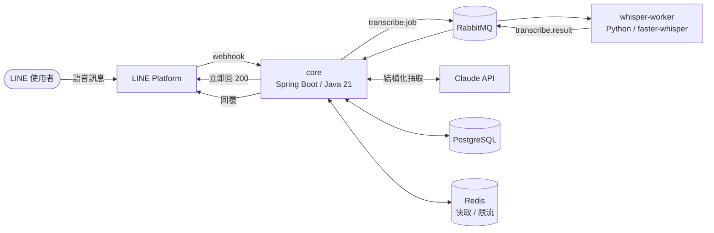

# SVRA — 個人語音知識助理平台

> 對 LINE 說一句話，系統轉錄、理解、歸檔，並能用自然語言問回來。

**專案緣起（2024）**：我一直覺得「有個助理幫你接住生活與工作的大小事」
不該是老闆的特權——每個人都值得有一個。所以在公司內部的 AI 創新應用競賽
做了第一版：LINE 收語音、Whisper 轉文字、同步到備忘錄。
127 行的單檔腳本（見 [legacy/app.py](legacy/app.py)），能動就好。

**為什麼重構成這樣（2026）**：先說清楚——以單人使用的規模，這套架構是**過度設計**的。
一天幾則語音訊息，2024 那版腳本完全夠用。

這是刻意的。我在上一份工作做了半年金流平台維運，看到的是系統的另一面：
**當冪等與失敗補償缺席時，維運端要承擔多少重複的、本來可以被設計掉的工作。**
我能定位問題、能給 workaround，但改不了根因。

「知道這些設計為什麼重要」和「親手把它做對」是兩回事。
這個 repo 是後者——拿一個我熟悉的產品當載體，把那些東西實作一次，
並且把每一步**為什麼這樣選、放棄了什麼、什麼情況會反悔**寫下來。

---

## 目前進度

| 狀態 | 項目 |
|------|------|
| ✅ | LINE webhook 接收：HMAC-SHA256 驗簽、秒回 200 |
| ✅ | `notes` schema（Flyway）＋ JPA entity／repository，含冪等唯一鍵 |
| ✅ | Python whisper worker（faster-whisper，端到端 smoke test 通過） |
| ✅ | docker-compose：PostgreSQL(pgvector) / RabbitMQ / Redis / worker |
| 🚧 | 音檔下載與 `transcribe.job` 發佈 |
| 🚧 | 轉錄結果消費、冪等去重 |
| 📋 | LLM 結構化抽取（Spring AI / LangChain4j） |

範圍凍結日：2026-08-18。凍結後的項目一律進 [Future Work](#future-work)，
但**每一項都會寫清楚「評估過、決定不做、理由是什麼」**——因為說得出取捨，
比做完但講不出所以然更有價值。

## 架構



| 組件 | 技術 | 職責 |
|------|------|------|
| core | Java 21 / Spring Boot 3.5 | Webhook 接收與驗簽、佇列編排、LLM 層 |
| whisper-worker | Python / faster-whisper | 語音轉文字（無狀態，可水平擴展） |
| 佇列 | RabbitMQ | 任務分派、DLQ 補償 |
| 儲存 | PostgreSQL | 筆記本體（pgvector 已備妥，RAG 見 Future Work） |
| 快取/限流 | Redis | LLM 成本控制 |

---

## Design Decisions & Trade-offs

### 1. Webhook 秒回 200，重活丟佇列

**決策**：webhook 驗完簽章立刻回 200，轉錄工作發到 RabbitMQ 非同步處理。

**為什麼**：LINE webhook 有逾時限制，而語音轉錄要數十秒——同步做**必然超時**。
更關鍵的是逾時後 LINE 會**重送同一則訊息**，所以「慢」不只是慢，是會**製造重複**。

**放棄了什麼**：使用者拿不到即時回覆（要靠後續 push 訊息通知），
系統多了一個需要維運的元件（佇列本身可能掛、可能堆積）。

**什麼情況會反悔**：如果轉錄能壓到 1 秒內（例如換成串流式短語音），
同步處理反而簡單；佇列的價值來自「工作比逾時長」這個前提。

### 2. 冪等：DB 唯一約束，不是「先查再插」

**決策**：`notes.source_message_id` 上建 UNIQUE 約束，重複時捕捉
`DataIntegrityViolationException` 視為「已處理過」。

**為什麼**：上游是 at-least-once，重送是常態不是意外。而常見的三種做法只有一種可靠：

| 做法 | 問題 |
|------|------|
| 先 `SELECT` 再 `INSERT` | **race condition**——兩個執行緒可能同時查到「不存在」然後都插入 |
| Redis 檢查已處理 id | 一樣有 race（檢查與寫入非原子，除非 `SETNX`）；且快取不是真相來源，掉資料就失效 |
| Java `synchronized` | 只鎖得住單一 JVM，多實例部署（多個 pod）立刻失效 |
| **DB 唯一約束** ✅ | 由資料庫層強制的原子性，跨執行緒、跨實例、跨重啟都成立 |

**放棄了什麼**：靠例外做流程控制在可讀性上不漂亮；且必須確保
`source_message_id` 真的穩定唯一。

**什麼情況會反悔**：如果冪等鍵不是單一欄位、或需要在寫 DB 前就擋掉
（例如避免昂貴的前置運算），會改用 Redis `SETNX` 當前置閘門，**但 DB 約束仍然保留當最後防線**。

### 3. RabbitMQ 而非 Kafka

**決策**：用 RabbitMQ。

**為什麼**：這是**任務佇列**（逐訊息 ack、失敗進 DLQ、公平分派給重活 worker），
不是事件流。Kafka 的 partition／offset／consumer group 模型在這裡沒有回報，只有運維成本。

**放棄了什麼**：訊息重播能力、超高吞吐、多消費者各自獨立進度。

**什麼情況會反悔**：當「同一份轉錄結果需要被多個下游各自消費」
（例如同時要進搜尋索引、進資料倉儲、觸發通知），或需要回溯重放歷史事件時，Kafka 才划算。

### 4. Java 編排 ＋ Python ML worker

**決策**：核心編排用 Java/Spring Boot，語音轉錄留在 Python。

**為什麼**：**語言邊界就是服務邊界**。ML 生態在 Python，企業級後端生態在 Java——
與其勉強在單一語言裡湊合，不如讓各自做最擅長的事，用佇列的 JSON 契約解耦。

**放棄了什麼**：多一套部署與監控、跨語言契約要自己維護版本、
本機開發要同時起兩個 runtime。

**什麼情況會反悔**：如果轉錄改成呼叫外部 API（不自己跑模型），
Python worker 就沒有存在必要，整併回 Java 更簡單。

### 5. 簽章驗證放在 Controller，不放 Filter

**決策**：HMAC 驗簽寫在 `LineWebhookController`，沒有抽到 Filter／Interceptor。

**為什麼**：橫切關注點原則上該進 Filter，但**簽章需要 raw body**，
而 request body 是 `InputStream`——**讀完就沒了**。在 Filter 讀了，
Controller 的 `@RequestBody` 就拿到空的，得用 `ContentCachingRequestWrapper`
包一層才能讀第二次。目前只有一個 webhook 端點，多包一層不划算。

**什麼情況會反悔**：接第二個 webhook 來源時（Slack／Stripe 各自的簽章格式），
就抽到 Filter 統一處理，那時 wrapper 的成本才有意義。

> 兩個實作細節：驗簽用 `@RequestBody String` 取**原始字串**
> （先反序列化再序列化回來會因空白／欄位順序差異導致簽章對不上）；
> 比對用 `MessageDigest.isEqual()` 而非 `equals()`——固定時間比較，避免 timing attack。

### 6. Package by feature，不是 by layer

**決策**：`io.svra.{line, transcription, note, assistant, llm}`，
而不是 `{controller, service, repository, entity}`。

**為什麼**：這是事件驅動系統，邊界天生清楚。按功能切的話，
**一個變更只動一個資料夾**，而且可以用 package-private 真正擋住跨模組呼叫——
按層切的話所有東西都必須 public，沒有任何機制防止亂呼叫。

**放棄了什麼**：不如分層直覺（多數教學文都是分層），新人上手需要適應。

> 注意：controller／service／repository 三層並沒有消失，只是住在各自的
> feature 資料夾裡。計畫加上 Spring Modulith 的 `ApplicationModules.verify()`
> 自動驗證邊界（見 Future Work）。

### 7. Schema 由 Flyway 單一管理，JPA 只驗證

**決策**：`spring.jpa.hibernate.ddl-auto=validate`，所有 schema 變更走 Flyway migration。

**為什麼**：**單一真相來源**。讓 Hibernate 也能改 schema，就會有兩個東西在管同一件事。
`validate` 讓「entity 與資料庫不一致」在**啟動時就失敗**，而不是執行到那段才炸。

**放棄了什麼**：開發初期改欄位要多寫一個 migration 檔，沒有 `update` 方便。

> 正式環境絕不用 `ddl-auto=update`：它會加欄位但不會刪、順序不可預測、無法 code review、無法回滾。

### 8. LLM 層用 Spring AI / LangChain4j，不自己手刻 client

**決策**（2026-07 修正）：原本規劃用 `RestClient` 手寫薄 client 直呼 Claude API，
改為使用 Spring AI 或 LangChain4j。

**為什麼**：框架的 `VectorStore` 抽象正好對應 pgvector、`FunctionCallback`
正好對應 tool use，與既定架構天然吻合；而且它已是 Java 生態處理 LLM 的共通詞彙。

**放棄了什麼**：對重試、快取、token 計量的控制權要透過框架的擴充點，不如手寫直接。

### 9. Redis 只做快取與限流

**決策**：Redis 用於「同輸入快取」與 per-user rate limit，**不作為資料真相來源**。

**為什麼**：LLM 是這個專案裡唯一按次計費的資源，快取與限流直接對應成本。
但快取就是快取——掉了要能重算，不能有任何正確性依賴它。

---

## 快速開始

```bash
cp .env.example .env      # 填入 LINE 憑證（憑證一律走環境變數，不進版控）
docker compose up -d      # postgres + rabbitmq + redis + whisper-worker

# 管線煙霧測試（首次會下載 Whisper 模型，建議先設 WHISPER_MODEL=tiny）
docker compose run --rm whisper-worker python scripts/smoke_test.py

# core 在本機跑（預設值已指向 compose 的服務）
cd core && mvn spring-boot:run

# 測試
cd core && mvn test
```

## 專案結構

```
├── core/             # Spring Boot 核心（開發清單見 core/TODO.md）
│   └── src/main/java/io/svra/
│       ├── line/         # LINE adapter：webhook 驗簽、messaging client
│       ├── transcription/# 轉錄編排：發 job、收 result、冪等
│       ├── note/         # 領域核心：Note entity / repository
│       ├── assistant/    # 分類抽取、問答編排
│       └── llm/          # LLM client：tool use、快取、限流
├── whisper-worker/   # Python 轉錄 worker（含煙霧測試）
├── eval/             # LLM 抽取的 eval 集（見 Future Work）
├── deploy/           # postgres init、K8s manifests
├── legacy/           # 重構前的原始腳本（憑證已改為環境變數）
└── docker-compose.yml
```

---

## Future Work

> 以下都是**評估過、刻意不做**的項目。列在這裡不是為了佔位，
> 而是因為「為什麼不做」本身就是工程判斷的一部分。

### RAG 與向量檢索（pgvector）

schema 已預留，但相似度檢索尚未實作。

**為什麼選 pgvector 而不是專用向量資料庫（Pinecone／Milvus／Qdrant）**：
個人規模下資料量在十萬筆以內，pgvector 完全吃得下；而且向量與筆記本體**同一個資料庫**
意味著可以在同一個交易裡寫入、可以直接 JOIN 做混合查詢（時間範圍＋語意相似度），
少一個需要同步與維運的相依。

**什麼情況值得拆出去**：向量數量到千萬級、需要專門的 ANN 索引調校（HNSW 參數）、
或檢索 QPS 高到會影響主資料庫的 OLTP 效能時。**在那之前，多一個元件就是多一個故障點。**

### Eval 集（LLM 回歸測試）

20～30 條測試案例（口語輸入 → 期望分類與欄位抽取），prompt 每次修改都跑一次準確率。

這是「串 API」與「工程化 LLM」的分水嶺——沒有 eval，改 prompt 就是在賭。
優先度最高的一項 Future Work。

### 可觀測性

Micrometer 自訂指標（佇列深度、轉錄 P95、token 用量）＋ Prometheus / Grafana。
告警設計的重點不是「有沒有告警」，是**誤報率**——寧可先誤報也不漏報，再用實際數據收斂閾值。

### Kubernetes 部署

`deploy/k8s/` 已有 manifests 草稿。上 K8s 需要處理的：stateless（session 外置）、
graceful shutdown（`server.shutdown=graceful` ＋ preStop 等摘流量）、
liveness/readiness probe 分工、以及 JVM 在容器裡要用 `-XX:MaxRAMPercentage`
而非寫死 `-Xmx`（否則看不見 cgroup 限制，會被 OOMKilled）。

### Spring Modulith 邊界驗證

用 `ApplicationModules.verify()` 讓「跨 package 亂呼叫」變成**編譯／測試期的失敗**，
並用 `Documenter` 自動產出模組關係圖。約一小時的投入。

### Multi-tenancy & Privacy

單人限定是**後端設計而非 LINE 限制**：LINE bot 本來就是官方帳號，webhook
天生帶 `userId`。要開放多用戶：

- 全表加 `user_id`、RAG 檢索加過濾、Redis key 加 namespace
- PostgreSQL Row-Level Security 在 DB 層強制隔離（app 層漏寫 where 也擋得住）

隱私光譜：平台治理 → at-rest 加密 → E2E 加密 → 自架開源模型。核心矛盾：
**E2E 加密與 server-side RAG 根本衝突**——伺服器看不到明文就無法做
embedding；要 E2E 就得把檢索搬到客戶端（成本、體驗全變）。這條光譜上
選哪一格，是產品定位問題，不是純技術問題。

### 其他

- 筆記的網頁瀏覽介面（目前 LINE 對話即介面）
- Whisper worker GPU 化與依佇列深度自動擴縮（KEDA）

---

## Origin

第一版是 127 行的單檔腳本（[legacy/app.py](legacy/app.py)）：同步處理、
憑證寫死、Flask 路由直接寫在 handler 裡。本 repo 是把它重構成正式系統的過程紀錄。
