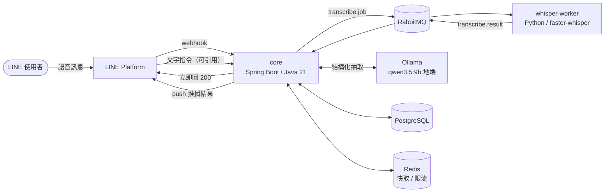

# SVRA — 個人語音知識助理平台

> 對 LINE 說一句話，系統轉錄、理解、歸檔，並能用自然語言問回來。

**專案緣起（2024）**：我一直覺得「有個助理幫你接住生活與工作的大小事」
不該是老闆的特權——每個人都值得有一個。所以在公司內部的 AI 創新應用競賽
做了第一版：LINE 收語音、Whisper 轉文字、同步到備忘錄。
127 行的單檔腳本（見 [legacy/app.py](legacy/app.py)），能動就好。

**為什麼重構成這樣（2026）**：先說清楚——以單人使用的規模，這套架構是**過度設計**的。
一天幾則語音訊息，2024 那版腳本完全夠用。

這是刻意的。我在上一份工作做了半年金流平台維運，看到的是系統的另一面：
**當冪等與失敗補償缺席時，維運端要承擔多少重複的、本來可以被設計掉的工作。**
我能定位問題、能給 workaround，但改不了根因。

「知道這些設計為什麼重要」和「親手把它做對」是兩回事。
這個 repo 是後者——拿一個我熟悉的產品當載體，把那些東西實作一次，
並且把每一步**為什麼這樣選、放棄了什麼、什麼情況會反悔**寫下來。

---

## 目前進度

| 狀態 | 項目 |
|------|------|
| ✅ | LINE webhook 接收：HMAC-SHA256 驗簽、秒回 200 |
| ✅ | `notes` schema（Flyway）＋ JPA entity／repository，含冪等唯一鍵 |
| ✅ | 轉錄 worker：faster-whisper ＋ Breeze-ASR-25（台灣調校） |
| ✅ | docker-compose：PostgreSQL(pgvector) / RabbitMQ / Redis / worker |
| ✅ | Transactional Outbox：音檔下載與 `transcribe.job` 發佈，含指數退避與 DLQ |
| ✅ | 轉錄結果消費、冪等去重 |
| ✅ | LLM 結構化抽取：Spring AI ＋ 地端 Ollama，含領域驗證與帶錯誤重試 |
| ✅ | 結果推播回 LINE |
| ✅ | 文字指令：刪除／改標題／改時間／新增／列出，一句話可含多個動作 |
| ✅ | Spring Modulith 模組邊界驗證（`ApplicationModules.verify()`） |
| ✅ | 抽取層 eval 集（8 題，prompt 迭代到 v6，8/8） |
| 📋 | RAG 與向量檢索（見 [Future Work](#future-work)） |

端到端已用真實 LINE 語音驗證：webhook → 驗簽 → note+outbox 同交易 →
poller 下載音檔 → RabbitMQ → whisper → 結果回寫 → LLM 抽取 → 推播回 LINE。
使用者可以引用推播訊息、用一句話修改或刪除其中的項目，也可以直接問「現在有什麼行程」。
**全程在本機執行，不呼叫任何付費 API。**

**全程在本機執行**：語音轉錄與語意抽取都是地端模型，不呼叫任何付費 API。

範圍凍結日：2026-08-18。凍結後的項目一律進 [Future Work](#future-work)，
但**每一項都會寫清楚「評估過、決定不做、理由是什麼」**——因為說得出取捨，
比做完但講不出所以然更有價值。

## 架構



| 組件 | 技術 | 職責 |
|------|------|------|
| core | Java 21 / Spring Boot 4.1 | Webhook 接收與驗簽、Outbox 編排、LLM 抽取 |
| whisper-worker | Python / faster-whisper ＋ Breeze-ASR-25 | 語音轉文字（無狀態，可水平擴展） |
| 佇列 | RabbitMQ | 任務分派、DLQ 補償 |
| 儲存 | PostgreSQL | 筆記本體、outbox 事件、抽取結果（pgvector 已備妥） |
| LLM | Spring AI ＋ Ollama | 結構化抽取，地端執行 |
| 快取/限流 | Redis | LLM 成本控制 |

---

## Design Decisions & Trade-offs

### 1. Webhook 秒回 200，重活丟佇列

**決策**：webhook 驗完簽章立刻回 200，轉錄工作發到 RabbitMQ 非同步處理。

**為什麼**：LINE webhook 有逾時限制，而語音轉錄要數十秒——同步做**必然超時**。
更關鍵的是逾時後 LINE 會**重送同一則訊息**，所以「慢」不只是慢，是會**製造重複**。

**放棄了什麼**：使用者拿不到即時回覆（要靠後續 push 訊息通知），
系統多了一個需要維運的元件（佇列本身可能掛、可能堆積）。

**什麼情況會反悔**：如果轉錄能壓到 1 秒內（例如換成串流式短語音），
同步處理反而簡單；佇列的價值來自「工作比逾時長」這個前提。

### 2. 冪等：DB 唯一約束，不是「先查再插」

**決策**：`notes.source_message_id` 上建 UNIQUE 約束，重複時捕捉
`DataIntegrityViolationException` 視為「已處理過」。

**為什麼**：上游是 at-least-once，重送是常態不是意外。而常見的三種做法只有一種可靠：

| 做法 | 問題 |
|------|------|
| 先 `SELECT` 再 `INSERT` | **race condition**——兩個執行緒可能同時查到「不存在」然後都插入 |
| Redis 檢查已處理 id | 一樣有 race（檢查與寫入非原子，除非 `SETNX`）；且快取不是真相來源，掉資料就失效 |
| Java `synchronized` | 只鎖得住單一 JVM，多實例部署（多個 pod）立刻失效 |
| **DB 唯一約束** ✅ | 由資料庫層強制的原子性，跨執行緒、跨實例、跨重啟都成立 |

**放棄了什麼**：靠例外做流程控制在可讀性上不漂亮；且必須確保
`source_message_id` 真的穩定唯一。

**什麼情況會反悔**：如果冪等鍵不是單一欄位、或需要在寫 DB 前就擋掉
（例如避免昂貴的前置運算），會改用 Redis `SETNX` 當前置閘門，**但 DB 約束仍然保留當最後防線**。

### 3. Transactional Outbox：先寫意圖，再送訊息

**決策**：`recordIncoming()` 在**同一個交易**裡寫 `notes` 與 `outbox_events`
兩張表，訊息由背景 poller 讀 outbox 後才真的發到 RabbitMQ。

**為什麼**：「寫資料庫」和「發訊息」是兩個系統，沒有共同的交易。
先發訊息再寫 DB，DB 失敗就發出了不存在的任務；先寫 DB 再發訊息，
發送失敗任務就永遠不會執行——而 note 停在 PENDING，**沒有人知道它被放棄了**。

Outbox 把「要發訊息」變成一筆資料，跟業務資料同進同退。
交易提交就代表意圖已持久化，RabbitMQ 掛掉只會延遲，不會遺失。

**放棄了什麼**：**Outbox 不消除兩系統提交問題，它把「可能遺失」換成「可能重複」**——
poller 送出訊息後、標記 SENT 前掛掉，重啟會再送一次。
代價是下游必須冪等（at-least-once），這也是為什麼 `applyTranscription()` 要擋重複結果。

還有輪詢延遲（本專案 2 秒）與一張要維運的表。

**多實例怎麼辦**：`SELECT ... FOR UPDATE SKIP LOCKED`——
多個 poller 各自鎖住不同批次，不會重複處理同一筆。

**踩過的坑：重試上限一度是假的。** poller 把處理器的例外接住、呼叫 `markFailed()`
累加次數，看起來很正常——但處理器的 `@Transactional` 在例外往外傳時已經把交易標成
rollback-only，外層 commit 時拋 `UnexpectedRollbackException`，**連 `markFailed()`
一起被回滾**。症狀是 `attempts` 永遠停在 0、事件無限重試、同一批的其他事件也陪葬。
處理器改跑在 `REQUIRES_NEW` 的獨立交易之後才真的生效。

**寫得出重試邏輯，不代表重試會發生**——交易邊界錯了，錯誤處理本身也會被回滾。

**什麼情況會反悔**：如果訊息遺失可以接受（例如可重算的衍生資料），
直接發訊息簡單得多。Outbox 的成本只有在「這筆任務不能掉」時才值得。

### 4. RabbitMQ 而非 Kafka

**決策**：用 RabbitMQ。

**為什麼**：這是**任務佇列**（逐訊息 ack、失敗進 DLQ、公平分派給重活 worker），
不是事件流。Kafka 的 partition／offset／consumer group 模型在這裡沒有回報，只有運維成本。

**放棄了什麼**：訊息重播能力、超高吞吐、多消費者各自獨立進度。

**什麼情況會反悔**：當「同一份轉錄結果需要被多個下游各自消費」
（例如同時要進搜尋索引、進資料倉儲、觸發通知），或需要回溯重放歷史事件時，Kafka 才划算。

### 5. Java 編排 ＋ Python ML worker

**決策**：核心編排用 Java/Spring Boot，語音轉錄留在 Python。

**為什麼**：**語言邊界就是服務邊界**。ML 生態在 Python，企業級後端生態在 Java——
與其勉強在單一語言裡湊合，不如讓各自做最擅長的事，用佇列的 JSON 契約解耦。

**放棄了什麼**：多一套部署與監控、跨語言契約要自己維護版本、
本機開發要同時起兩個 runtime。

**什麼情況會反悔**：如果轉錄改成呼叫外部 API（不自己跑模型），
Python worker 就沒有存在必要，整併回 Java 更簡單。

### 6. 簽章驗證放在 Controller，不放 Filter

**決策**：HMAC 驗簽寫在 `LineWebhookController`，沒有抽到 Filter／Interceptor。

**為什麼**：橫切關注點原則上該進 Filter，但**簽章需要 raw body**，
而 request body 是 `InputStream`——**讀完就沒了**。在 Filter 讀了，
Controller 的 `@RequestBody` 就拿到空的，得用 `ContentCachingRequestWrapper`
包一層才能讀第二次。目前只有一個 webhook 端點，多包一層不划算。

**什麼情況會反悔**：接第二個 webhook 來源時（Slack／Stripe 各自的簽章格式），
就抽到 Filter 統一處理，那時 wrapper 的成本才有意義。

> 兩個實作細節：驗簽用 `@RequestBody String` 取**原始字串**
> （先反序列化再序列化回來會因空白／欄位順序差異導致簽章對不上）；
> 比對用 `MessageDigest.isEqual()` 而非 `equals()`——固定時間比較，避免 timing attack。

### 7. Package by feature，並讓邊界成為會失敗的測試

**決策**：`io.svra.{webhook, line, note, outbox, mq, extract, notify, command}`，
而不是 `{controller, service, repository, entity}`。加上 Spring Modulith 的
`ApplicationModules.verify()`。

**為什麼**：這是事件驅動系統，邊界天生清楚。按功能切的話，
**一個變更只動一個資料夾**，而且可以用 package-private 真正擋住跨模組呼叫。

分成三層責任：

| | package | 責任 |
|---|---|---|
| 入站 | `webhook/` | LINE 對我們說話：驗簽、解析、分派 |
| 出站 | `line/` | 我們對 LINE 說話：下載音檔、推播 |
| 領域 | `note/` | `Note`、`NoteExtraction`、`NoteItem` 與其 repository |
| 基礎設施 | `outbox/`、`mq/` | 事件轉送、佇列 topology |
| 功能 | `extract/`、`notify/`、`command/` | 各自消費領域模型 |

每個功能 package 對外只露出一個入口，其餘收成 package-private：

| package | 對外可見 | 收在裡面 |
|---|---|---|
| `extract/` | `NoteExtractionService` | `NoteExtractor`、`ExtractedNote` |
| `notify/` | `NoteNotifier` | — |
| `command/` | `NoteCommandService` | `NoteCommandParser`、`NoteCommand` |

**放棄了什麼**：不如分層直覺（多數教學文都是分層），新人上手需要適應。

#### 這則決策踩過兩次，第二次是工具抓到的

**第一次**：加推播與指令功能時，我把它們放進了 `extract/`——因為實體已經在那裡。
那是 by-layer 的慣性：按「技術上相依什麼」放，而不是按「這是什麼功能」放。

**第二次**：搬完之後看起來很整齊，`ApplicationModules.verify()` 一跑就爆出環狀依賴。
**檔案位置對了，相依方向還是纏的：**

```
outbox  ↔ 每一個功能   poller 用 switch 認識全部四種事件，功能又回頭寫 outbox
line    ↔ command      控制器呼叫指令服務，指令服務又用 LinePushClient
note    ↔ mq           NoteService 的參數型別是 RabbitMQ 的訊息格式
```

三個都是真的設計問題，不是工具太嚴格：

- **基礎設施不該認識業務**。poller 改成只認識 `OutboxEventHandler` 介面，
  各功能自己實作並註冊——加新事件型別不用改 poller。
- **入站與出站是相反方向**，放同一個 package 必然成環。`webhook/` 與 `line/` 拆開後，
  `line/` 對其他模組零依賴。
- **領域不該認識傳輸格式**。`applyTranscription` 原本收 `TranscribeResult`
  （帶著 `@JsonProperty` 與 status／elapsedSec），改成收四個值，翻譯由 listener 做。

> **package-private 擋得住細節外流，擋不住 public 型別之間的相依。**
> 前者靠切法，後者只有工具擋得住——所以 `ApplicationModules.verify()` 不是加分項，
> 是讓這則決策從慣例變成約束的那一步。`Documenter` 會一併產出模組關係圖，
> 結構的變化在 review 時看得見。

### 8. Schema 由 Flyway 單一管理，JPA 只驗證

**決策**：`spring.jpa.hibernate.ddl-auto=validate`，所有 schema 變更走 Flyway migration。

**為什麼**：**單一真相來源**。讓 Hibernate 也能改 schema，就會有兩個東西在管同一件事。
`validate` 讓「entity 與資料庫不一致」在**啟動時就失敗**，而不是執行到那段才炸。

**放棄了什麼**：開發初期改欄位要多寫一個 migration 檔，沒有 `update` 方便。

> 正式環境絕不用 `ddl-auto=update`：它會加欄位但不會刪、順序不可預測、無法 code review、無法回滾。

### 9. LLM 層用 Spring AI，模型跑在地端

**決策**：用 Spring AI 當抽象層，模型是本機 Ollama 上的 qwen3.5:9b。

**為什麼**：抽象層的價值不在「看起來比較乾淨」，在於**換供應商的成本**。
實際換過一次（Anthropic API → 地端 Ollama）動到的東西：

```
core/pom.xml                 starter 一行
application.yml              一段設定
NoteExtractor.java           0 行   ← 呼叫端沒動
測試                          0 行
```

跑地端還有兩個附帶好處：**成本歸零**，以及**語音筆記不離開自己的機器**。

**放棄了什麼**：地端 9B 模型的推理不如雲端旗艦。實測同一段逐字稿，
曾經有個案例：Whisper 把「奮起湖」轉成「正啟湖」，抽取層照原樣保留——
符合 prompt 裡「判斷不出來就照原樣」的規則。**後來才發現那不是抽取層的問題**，
換掉 ASR 模型之後就沒了（見決策 14）。

**什麼情況會反悔**：抽取準確率成為瓶頸時就換模型。`note_extractions`
表的存在就是為了這個——換模型不覆蓋舊結果，兩版並存後再決定用哪個。

> 踩到的坑：qwen3.5 是**思考模型**，預設會思考，一次抽取從 12 秒變成 200 秒以上，
> 而且回應的 `content` 有時是空的。關閉思考需要 `spring.ai.ollama.chat.think`，
> 這個設定鍵到 Spring AI 2.0 才綁得上（1.1.8 雖有 `think-option`，
> 但缺 Boolean → ThinkOption 的轉換器），而 Spring AI 2.0 需要 Spring Boot 4。

### 10. 結構化輸出之外，還要領域驗證

**決策**：LLM 回傳的結果先過 `validate()`，不通過就把**錯誤訊息帶回去**重試一次。

**為什麼**：**結構化輸出解決格式，不解決正確性。**
模型可以回傳完全合法的 JSON，卻把 2026 年的行程推斷成 2019 年。
所以除了 schema，還要檢查內容合不合理：日期在合理範圍、
分類為 SCHEDULE 就必須有時間、title 不可空白。

重試時把驗證錯誤塞回 prompt，而不是單純重送——**模型不知道自己錯了**，
同樣的輸入只會得到同樣的機率分佈。把「你上次 occursAt 給了 8月16號，
那不是 ISO-8601」放進去，它才知道要修哪裡。

**放棄了什麼**：多一次 LLM 呼叫的延遲與成本（地端的話只有延遲）。

**這一層擋不住什麼**：內容錯但格式與範圍都合法的情況。
實測就遇到一次——`detail` 寫「8月16日」但 `occursAt` 填成 08-15，
兩者不一致而驗證抓不到。要抓需要跨欄位的一致性檢查，那是下一層的事。

### 11. 指代解析靠 LINE 的引用，不靠對話狀態

**決策**：使用者引用某則推播訊息下指令時，用 webhook 帶的 `quotedMessageId`
反查是哪一批項目；沒引用時查「這位使用者目前還有效的全部項目」（跨所有語音）。

**為什麼**：「把第二筆改成 8/16」的「第二筆」是相對於某則訊息的。
常見做法是在伺服器記住「這個使用者上次看到什麼」，但那是**對話狀態**——
多裝置、訊息亂序、使用者隔天才回覆，全都會讓它失準。

LINE 的引用功能把這個狀態**放在訊息本身**：使用者指哪則，webhook 就告訴你哪則。
伺服器不需要記憶，也不會過期。

**放棄了什麼**：要多存一欄（`note_extractions.notify_message_id`）。
沒引用時的退路一開始是「最近一次的抽取」，後來改成跨語音查詢——因為使用者問
「現在有什麼行程」時，要的是目前全部，不是最後那則語音的內容。

**編號必須三邊一致**：推播、指令解析、依編號取值都走
`NoteCategory.DISPLAY_ORDER`。這件事一度是壞的——推播依分類重排後編號，
指令那邊用 JPA 給的原始順序，只要抽取結果不是剛好那個順序，「刪掉第一筆」
就會**刪錯而且不報錯**。`ItemNumberingConsistencyTest` 現在守著它。

**什麼情況會反悔**：真正的跨筆記批次操作（「把這週的行程都刪掉」）還是不夠——
目前只做到「跨筆記查詢」，批次條件式刪除得引入工作階段或查詢語言。
引用舊推播時也還有編號漂移的問題（那批被刪過就會重新編號），要解得存編號快照。

### 12. 只做一半要說出來

**決策**：`NoteCommand` 有一個 `unhandled` 欄位，讓 LLM 回報「這次沒能處理的部分」，
回覆時附在後面。

**為什麼**：實測時使用者一句話講了兩件事——「時間應該放在最前面，然後第二筆是 8/16」。
系統只做得到改時間，於是**默默做了一半，回覆也只提改時間**。

這比「看不懂」更糟：看不懂使用者知道要換句話說，做一半使用者以為都交代了。

**放棄了什麼**：多信任 LLM 一個欄位——它可能漏報，或把做到的事誤報成沒做到。

### 13. ASR 用台灣調校的 Breeze-ASR-25，不是更大的 Whisper

**決策**：轉錄模型從 `whisper small` 換成聯發科的 `Breeze-ASR-25`（Whisper large-v2 為底，
已轉成 CTranslate2，可直接餵給 faster-whisper）。

**為什麼**：抽取層的 eval 是 8/8，但實際用起來還是有錯——**錯在上游**。
拿同一段（有背景音的）錄音跑三方比較：

| | 奮起湖 | KKday | 轉錄耗時 |
|---|---|---|---|
| `small`（原本） | ✖ 正啟湖 | ✖ KKM | 6s |
| `large-v3`（單純變大） | ✔ | ✖ 認不出 | 31s |
| `Breeze-ASR-25`（台灣調校） | ✔ | ✔ | 33s |

**第二欄是關鍵**：`KKday` 是中英夾雜，`large-v3` 也修不好，只有台灣調校版能處理——
證明差別來自訓練資料而不是參數量。順帶修好「重新被組成」→「從新北土城」、
「QQ客戶」→「QR code」。

**放棄了什麼**：轉錄從 6 秒變 33 秒，模型從 244MB 變 1.5GB。
這個代價架構已經吸收了——轉錄本來就是非同步的，使用者等 30 秒或 40 秒沒有差別。
**這是「重活丟佇列」那個決策的回報**：它讓後來的品質升級不需要動架構。

**試過但撤回的**：VAD（先切掉非語音段落）。直覺上對有背景音的錄音應該有幫助，
實測反而丟字——「奮起湖」在 VAD 開的時候消失。這段是連續獨白、幾乎沒有靜默，
VAD 沒東西可切，只在語音邊界削掉內容。**理由留在程式碼旁邊**，之後遇到大量靜默
或幻覺迴圈的錄音再回頭量一次。

### 14. Redis 只做快取與限流

**決策**：Redis 用於「同輸入快取」與 per-user rate limit，**不作為資料真相來源**。

**為什麼**：LLM 是這個專案裡唯一按次計費的資源，快取與限流直接對應成本。
但快取就是快取——掉了要能重算，不能有任何正確性依賴它。

---

### 15. 全部服務進 compose，但 Ollama 留在宿主機

**決策**：core 也容器化，`restart: unless-stopped`；**唯獨 Ollama 不進容器**。

**為什麼要容器化 core**：原本 core 靠 `./run-core.sh` 在終端機裡跑，
關掉視窗或重開機它就沒了——而**其他四個服務都還活著**，
看起來一切正常，實際上 webhook 沒有人接。LINE 不會把那段時間的訊息補送，
**那些語音就是永久遺失**。這不是重試機制救得回來的，
因為 outbox 要能重試的前提是「事件已經寫進資料庫」。

**為什麼 Ollama 不進容器**：模型權重 6.6 GB，而且容器裡吃不到 macOS 的
Metal GPU 加速，純 CPU 推論會慢好幾倍。所以它留在宿主機，
容器用 `host.docker.internal` 連回去。

**代價**：多了一個「要記得啟動」的東西，只是從 core 換成了 Ollama。
真正的解法是把 Ollama 也交給行程管理（`brew services`），而不是手動開。

**什麼情況我會反悔**：部署到 Linux 主機且有 NVIDIA GPU 時，
Ollama 容器可以直接吃 `--gpus all`，那時就沒有留在宿主機的理由了。

---

## 快速開始

```bash
cp .env.example .env      # 填入 LINE 憑證（憑證一律走環境變數，不進版控）

# 地端 LLM。Ollama 跑在宿主機不是容器裡——模型權重大，
# 而且容器裡吃不到 macOS 的 Metal 加速。
brew install ollama && brew services start ollama
ollama pull qwen3.5:9b    # 約 6.6 GB，建議 16 GB 以上記憶體

docker compose up -d      # postgres + rabbitmq + redis + whisper-worker

# 對外入口：LINE 要打得到 webhook
ngrok start svra          # 固定網域，webhook URL 設定一次就不用再改
```

`ngrok.yml` 裡綁了固定網域。用臨時網址（`ngrok http 8080` 或 cloudflared quick tunnel）
每次重啟都會換網址，得回 LINE 後台重貼一次——而它斷線時**不會有任何提示**，
只會安靜地收不到訊息。macOS 上裝成 LaunchAgent（`~/Library/LaunchAgents/io.svra.ngrok.plist`）
讓它開機自動起、掛掉自動重啟。

轉錄模型（Breeze-ASR-25）首次啟動時自動下載約 1.5 GB，快取在 docker volume。

core 本身在本機跑（改一行不用重建映像檔）：

```bash
./run-core.sh              # 讀 .env 並把 AUDIO_DIR 指到共享目錄
```

要整套都在容器裡（部署或驗證用）：

```bash
docker compose --profile full up -d    # 連 core 一起
```

⚠️ 兩邊都綁 8080，不要同時開。容器版沒停乾淨的話，本機這支會啟動失敗；
反過來，本機那支沒關就 `--profile full`，容器的埠會發布不出去而**不報錯**。

`run-core.sh` 存在的理由是 `.env` 只有 compose 在讀，`mvn spring-boot:run` 不會讀；
而 `audio-dir` 用相對路徑會依啟動目錄而變，兩端就會讀寫不同地方。

要換模型只需覆寫環境變數，不用改程式：

```bash
OLLAMA_MODEL=llama3.1:8b ./run-core.sh
```

測試：

```bash
cd core && mvn test        # 單元測試
cd core && mvn test -Peval # eval 集（會呼叫真的 LLM，慢）
```

## 專案結構

```
├── core/             # Spring Boot 核心（開發清單見 core/TODO.md）
│   └── src/main/java/io/svra/
│       ├── webhook/      # 入站：LINE webhook 驗簽、事件解析與分派
│       ├── line/         # 出站：音檔下載、推播（對其他模組零依賴）
│       ├── note/         # 領域核心：Note / NoteExtraction / NoteItem 與其 repository
│       ├── outbox/       # Transactional Outbox：事件表、poller、退避重試
│       ├── mq/           # RabbitMQ topology、job/result 契約、結果 listener
│       ├── extract/      # LLM 抽取：prompt、領域驗證、版本化結果
│       ├── notify/       # 把抽取結果排版後推回 LINE
│       └── command/      # 文字指令：意圖解析、套用、回報
├── whisper-worker/   # Python 轉錄 worker（含煙霧測試）
├── eval/             # LLM 抽取的 eval 集（見 Future Work）
├── deploy/           # postgres init、K8s manifests
├── legacy/           # 重構前的原始腳本（憑證已改為環境變數）
└── docker-compose.yml
```


---

## Future Work

> 以下都是**評估過、刻意不做**的項目。列在這裡不是為了佔位，
> 而是因為「為什麼不做」本身就是工程判斷的一部分。

### RAG 與向量檢索（pgvector）

schema 已預留，但相似度檢索尚未實作。

**為什麼選 pgvector 而不是專用向量資料庫（Pinecone／Milvus／Qdrant）**：
個人規模下資料量在十萬筆以內，pgvector 完全吃得下；而且向量與筆記本體**同一個資料庫**
意味著可以在同一個交易裡寫入、可以直接 JOIN 做混合查詢（時間範圍＋語意相似度），
少一個需要同步與維運的相依。

**什麼情況值得拆出去**：向量數量到千萬級、需要專門的 ANN 索引調校（HNSW 參數）、
或檢索 QPS 高到會影響主資料庫的 OLTP 效能時。**在那之前，多一個元件就是多一個故障點。**

### Eval 集的累積與門檻

`eval/` 已經有 8 題與 runner（`mvn test -Peval`），但還沒做兩件事：

**把結果存檔**，累積一張「prompt 版本 vs 準確率」的對照表。現在只印在終端機，
改完 prompt 只能靠記憶比較。

**當成 CI 閘門**。目前跑完只印分數不 assert——因為「幾分算通過」取決於當下的目標：
剛換模型時 70% 可能是好消息，穩定之後 90% 可能是退步。先射箭再畫靶沒有意義，
等準確率穩定了再訂門檻。

案例也需要繼續從真實語音累積。自己編的漂亮句子測不出模型會在哪裡失敗——
目前 8 題裡只有一題是真實逐字稿。

### 可觀測性

Micrometer 自訂指標（佇列深度、轉錄 P95、token 用量）＋ Prometheus / Grafana。
告警設計的重點不是「有沒有告警」，是**誤報率**——寧可先誤報也不漏報，再用實際數據收斂閾值。

### Kubernetes 部署

`deploy/k8s/` 已有 manifests 草稿。上 K8s 需要處理的：stateless（session 外置）、
graceful shutdown（`server.shutdown=graceful` ＋ preStop 等摘流量）、
liveness/readiness probe 分工、以及 JVM 在容器裡要用 `-XX:MaxRAMPercentage`
而非寫死 `-Xmx`（否則看不見 cgroup 限制，會被 OOMKilled）。

### Multi-tenancy & Privacy

單人限定是**後端設計而非 LINE 限制**：LINE bot 本來就是官方帳號，webhook
天生帶 `userId`。要開放多用戶：

- 全表加 `user_id`、RAG 檢索加過濾、Redis key 加 namespace
- PostgreSQL Row-Level Security 在 DB 層強制隔離（app 層漏寫 where 也擋得住）

隱私光譜：平台治理 → at-rest 加密 → E2E 加密 → 自架開源模型。核心矛盾：
**E2E 加密與 server-side RAG 根本衝突**——伺服器看不到明文就無法做
embedding；要 E2E 就得把檢索搬到客戶端（成本、體驗全變）。這條光譜上
選哪一格，是產品定位問題，不是純技術問題。

### 其他

- 筆記的網頁瀏覽介面（目前 LINE 對話即介面）
- Whisper worker GPU 化與依佇列深度自動擴縮（KEDA）

---

## Origin

第一版是 127 行的單檔腳本（[legacy/app.py](legacy/app.py)）：同步處理、
憑證寫死、Flask 路由直接寫在 handler 裡。本 repo 是把它重構成正式系統的過程紀錄。
